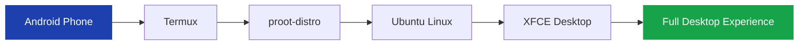

# Welcome to Android Desktop Linux

**Android Desktop Linux (ADL)** is the open knowledge base that shows you how to turn your Android phone or tablet into a full Linux desktop computer — no root required, no warranty voided, no risk to your device.

Connect a monitor, keyboard, and mouse to a Samsung Galaxy with DeX, or use your phone screen with a touch-friendly desktop environment. Either way, you get a real Linux desktop running real Linux applications.

## Who is this for?

This documentation is written for **everyone**, regardless of experience level.

- **Complete beginners** who have never used Linux before
- **Android enthusiasts** who want to push their device further
- **Developers** looking for a portable development environment
- **Students** who need a desktop computer on a budget
- **Power users** who want Linux everywhere they go

:::tip No experience required
Every technical term is explained before it is used. Every command includes what it does, why you need it, and what to do if something goes wrong.
:::

## How this documentation is organized

<Decision
  question="Where should I start?"
  options={[
    {
      label: "Quick Start",
      description: "Get a working Linux desktop in 30-45 minutes. Minimal explanation, maximum efficiency. Copy-paste commands with expected results at every step.",
      recommended: true,
    },
    {
      label: "Learn",
      description: "Understand how everything works before you begin. Concepts, architecture, software choices, and hardware recommendations explained from scratch.",
    },
    {
      label: "Reference",
      description: "Look up specific commands, configuration options, compatibility information, or troubleshooting steps. Best when you already have ADL installed.",
    },
  ]}
/>

### The three tracks

| Track | Purpose | Best for |
|---|---|---|
| [**Quick Start**](/docs/quick-start/overview) | Working desktop in 30-45 min | "Just get it running" |
| [**Learn**](/docs/category/learn) | Deep explanations of every concept | "I want to understand first" |
| [**Reference**](/docs/category/reference) | Searchable technical reference | "I need to look something up" |

Every concept has **one canonical explanation** in the Learn section. Other pages link to it rather than repeating it. This means information is always accurate and up to date, no matter where you find it.

## What you will build

By the end of the Quick Start, you will have:

- A complete **Ubuntu Linux** installation on your Android device
- The **XFCE desktop environment** with a taskbar, file manager, and application menu
- A working **web browser** (Firefox)
- **Audio support** for media playback
- Optional: **Samsung DeX** integration for an external monitor, keyboard, and mouse

<Note title="No modifications to your phone">
  The setup ADL documents runs entirely inside the Termux app. It does not
  modify your Android system, does not require root access, and does not void
  your warranty. Uninstalling is as simple as deleting the Termux app.
</Note>

## Primary hardware

This documentation is built around the **Samsung Galaxy S22+** with Snapdragon 8 Gen 1 and 8 GB RAM, but ADL works on most modern Android devices. See [Supported Devices](/docs/reference/compatibility/supported-devices) for the full compatibility list.

## Ready to start?

- **[Quick Start →](/docs/quick-start/overview)** — Get a working desktop in 30-45 minutes
- **[What is Android Desktop Linux? →](/docs/learn/concepts/what-is-linux)** — Start with the fundamentals
- **[Downloads →](/docs/category/downloads)** — Get all required software
