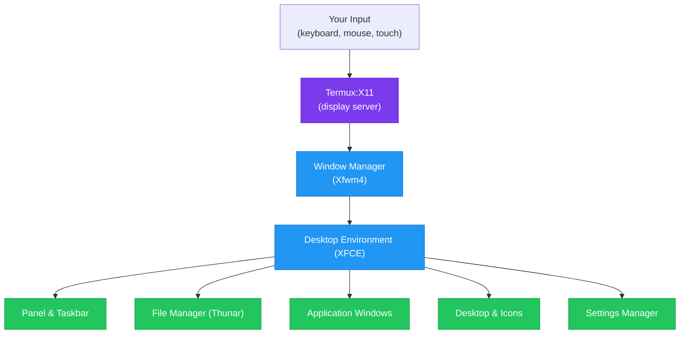

# What is a Desktop Environment?

A **desktop environment** (DE) is the collection of software that provides the graphical interface you interact with on a computer. It includes the windows, menus, taskbar, desktop icons, file manager, and all the visual elements that let you use your computer by pointing and clicking rather than typing commands.

If the Linux kernel is the engine and Ubuntu is the car, the desktop environment is the **dashboard, steering wheel, and interior** — everything the driver actually touches.

## What a Desktop Environment Provides

A desktop environment includes several interconnected components:

| Component | What it does | Example |
|---|---|---|
| **Window Manager** | Controls how windows move, resize, and stack | Xfwm4 (XFCE), Mutter (GNOME) |
| **Panel/Taskbar** | Shows running apps, system tray, clock | XFCE Panel, MATE Panel |
| **File Manager** | Browse and manage files visually | Thunar, Nautilus, Caja |
| **Application Launcher** | Start programs from a menu | Whisker Menu, App Grid |
| **Settings Manager** | Configure display, themes, input devices | XFCE Settings, GNOME Settings |
| **Desktop** | The background area with optional icons | Xfdesktop, MATE Desktop |
| **Notification System** | Pop-up alerts from applications | xfce4-notifyd |
| **Session Manager** | Handles login, logout, saving state | xfce4-session |
| **Default Applications** | Text editor, terminal, image viewer | Mousepad, xfce4-terminal, Ristretto |

## Comparing to What You Already Know

If you have used a smartphone, you already understand the concept of a desktop environment — you just know it by a different name.

| Your Phone | Desktop Environment |
|---|---|
| Home screen | Desktop |
| App drawer | Application menu |
| Status bar (top) | Panel/taskbar |
| Recent apps | Window list / task switcher |
| Settings app | Settings manager |
| Files app | File manager |
| Swiping to switch apps | Alt+Tab or clicking the taskbar |
| Long-press for options | Right-click for context menu |

The key difference is that a desktop environment shows **multiple windows on screen simultaneously**, which is what makes it productive for complex work.

[Screenshot: XFCE desktop showing a taskbar at the top, file manager window, and application menu open — comparable to a typical Windows or macOS layout]

## Why You Need One

Without a desktop environment, Linux is just a terminal — a black screen with a text cursor. That is powerful for some tasks, but most people want to:

- See multiple applications side by side
- Drag and drop files
- Use applications with graphical interfaces (word processors, image editors, browsers)
- Have a familiar point-and-click experience

A desktop environment transforms the terminal-based Linux system into something that looks and feels like a traditional computer.

## Desktop Environments for ADL

Not all desktop environments are suitable for running on a phone through proot. The ideal DE for ADL needs to be:

1. **Lightweight** — phones have less RAM and CPU than desktops
2. **ARM compatible** — must run well on ARM processors
3. **Low memory usage** — leaving room for your applications
4. **Responsive** — should not feel sluggish on mobile hardware
5. **Functional** — must include all essential desktop components
6. **Stable** — reliability matters on a daily-use device

Here is how the major desktop environments compare:

| Desktop Environment | RAM Usage | CPU Load | ARM Support | Customizable | Best For |
|---|---|---|---|---|---|
| **XFCE** | ~300-400 MB | Low | Excellent | High | ADL (recommended) |
| **LXDE** | ~200-300 MB | Very low | Good | Moderate | Very old/low-spec devices |
| **LXQt** | ~250-350 MB | Low | Good | Moderate | Qt application users |
| **MATE** | ~400-500 MB | Moderate | Good | High | GNOME 2 fans |
| **Cinnamon** | ~500-700 MB | Moderate | Fair | High | Windows users |
| **KDE Plasma** | ~500-800 MB | Moderate-High | Good | Very high | Customization enthusiasts |
| **GNOME** | ~700-1200 MB | High | Good | Low-Moderate | Modern touchscreen UIs |
| **Budgie** | ~500-600 MB | Moderate | Fair | Moderate | Clean, simple interface |

<Warning>
GNOME and KDE Plasma may work on high-end phones (8GB+ RAM, flagship processor) but will feel sluggish on most devices. They were designed for desktop computers with significantly more resources. For the best experience, stick with XFCE or LXDE.
</Warning>

### XFCE (Recommended)

XFCE is a lightweight, full-featured desktop environment that offers the best balance of performance and functionality for ADL.

**Strengths:**
- Low memory footprint (~300-400 MB)
- Fast and responsive on ARM processors
- Highly customizable (panels, themes, keyboard shortcuts)
- Complete set of applications included
- Very stable and mature (20+ years of development)
- Excellent documentation

**Weaknesses:**
- Appearance is more traditional (not as "modern" as GNOME)
- Fewer animations and visual effects
- Some settings require more clicks to find

[Screenshot: XFCE desktop with customized panel, showing file manager and terminal side by side]

### LXDE

LXDE is even lighter than XFCE but less feature-rich.

**Strengths:**
- Lowest memory usage of any full DE
- Very fast on low-spec hardware
- Simple and straightforward

**Weaknesses:**
- Fewer customization options
- Less active development (LXQt is its successor)
- Fewer built-in utilities
- Dated appearance

### MATE

MATE is a continuation of the GNOME 2 desktop, offering a traditional layout with more features than XFCE.

**Strengths:**
- Familiar traditional desktop layout
- More built-in tools than XFCE
- Active development
- Good customization options

**Weaknesses:**
- Uses more RAM than XFCE
- Slightly heavier on CPU
- Some components are resource-intensive

### KDE Plasma

KDE Plasma is the most customizable desktop environment available, with a Windows-like interface.

**Strengths:**
- Extremely customizable — change almost anything
- Modern and polished appearance
- Excellent application suite (Dolphin, Kate, Konsole)
- Windows-like default layout

**Weaknesses:**
- Higher memory and CPU usage
- Can feel sluggish on mid-range phones
- More complex settings
- Larger installation size

<Decision
  question="Which desktop environment should I use with ADL?"
  options={[
    {
      label: "XFCE",
      description: "Best balance of features and performance. Low memory usage, fast on ARM, highly customizable. Recommended for most users and the default ADL choice.",
      recommended: true
    },
    {
      label: "LXDE",
      description: "Even lighter than XFCE but fewer features. Choose this if your phone has less than 4GB of RAM or you want the absolute fastest experience.",
      recommended: false
    },
    {
      label: "MATE",
      description: "More features than XFCE but heavier. Good if you want a richer desktop and have a phone with 6GB+ RAM.",
      recommended: false
    },
    {
      label: "KDE Plasma",
      description: "Maximum customization but heaviest resource usage. Only recommended for high-end phones with 8GB+ RAM and flagship processors.",
      recommended: false
    }
  ]}
/>

## Desktop Environment Architecture

Here is how a desktop environment fits into the ADL stack:

## Customizing Your Desktop

One of the biggest advantages of Linux desktop environments over Android or iOS is the level of customization available:

| What you can customize | Examples |
|---|---|
| **Theme** | Dark mode, light mode, custom color schemes |
| **Icons** | Different icon packs (Papirus, Adwaita, Numix) |
| **Panel position** | Top, bottom, left, right, or multiple panels |
| **Panel contents** | Clock format, system tray items, launchers |
| **Fonts** | System font, size, rendering style |
| **Window buttons** | Position (left or right), which buttons to show |
| **Desktop wallpaper** | Any image you choose |
| **Keyboard shortcuts** | Remap any action to any key combination |
| **Mouse behavior** | Click behavior, scroll speed, natural scrolling |
| **File manager layout** | Icon view, list view, split panes |

<Tip>
Do not spend too much time customizing when you first set up ADL. Get comfortable with the defaults first, then personalize once you know what you want to change. XFCE's defaults are sensible and productive.
</Tip>

<FAQ items={[
  {
    question: "Can I change my desktop environment later?",
    answer: "Yes, but it is not as simple as flipping a switch. You would need to install the new DE's packages and potentially remove the old one. The cleanest approach is to back up your data, reset the proot environment, and reinstall with the new DE. Mixing multiple desktop environments in one installation can cause conflicts."
  },
  {
    question: "Do I need a desktop environment at all?",
    answer: "Not technically. If you only need terminal access, you can use Termux directly without installing a desktop environment. However, for graphical applications (browsers, office suites, image editors), you need a DE or at least a window manager. Most ADL users want the full desktop experience."
  },
  {
    question: "Will my desktop look exactly like a PC?",
    answer: "Very close. XFCE on ADL looks and behaves nearly identically to XFCE on a PC. The main differences are related to screen resolution, available hardware (no dedicated GPU), and the fact that the display is provided by Termux:X11 rather than a native X server. Day-to-day use feels the same."
  },
  {
    question: "Can I use tiling window managers instead?",
    answer: "Yes, advanced users can install tiling window managers like i3, Sway, or dwm instead of a full desktop environment. These are extremely lightweight but require significant configuration and keyboard-driven workflows. They are not covered by ADL documentation but work in principle."
  }
]} />

## Summary

A desktop environment is the graphical layer that makes Linux visual and interactive. For ADL, XFCE is the recommended choice because it offers the best balance of features, performance, and customization for running on Android hardware. It provides a complete desktop experience — windows, menus, file management, and application launching — while keeping resource usage low enough to run smoothly on your phone.

**Next:** Learn about [XFCE](./what-is-xfce.md) in detail — its components, customization options, and keyboard shortcuts.
