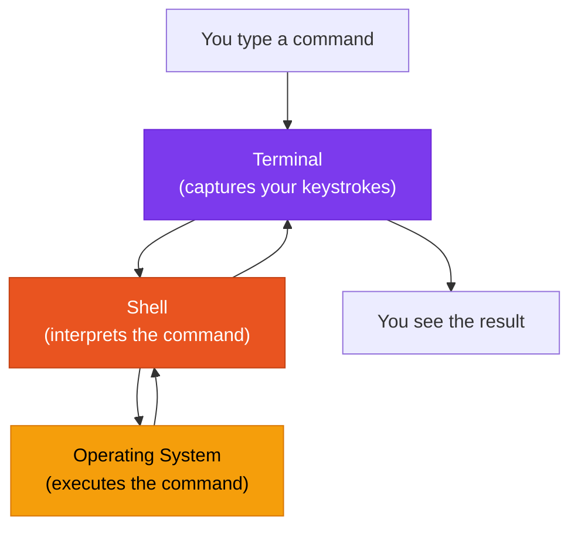

# What is a Shell?

A shell is a **command interpreter** -- the program that reads what you type in the terminal, figures out what you mean, and executes it. When you type `ls` and press Enter, it is the shell that understands "list the files in the current directory," runs the appropriate program, and displays the result.

The terminal is the window. The shell is the brain inside it.

## Shell vs. Terminal

This distinction confuses many beginners, so here is a clear breakdown:

| Concept | What It Is | Analogy |
|---|---|---|
| **Terminal** | The application that displays text and captures keyboard input | A telephone handset |
| **Shell** | The program that interprets commands and produces output | The person you are talking to |

You can swap out either one independently. You could use a different terminal application (Termux, xfce4-terminal, Alacritty) while keeping the same shell. Or you could switch your shell (from bash to zsh) while using the same terminal.

When you open Termux, it automatically starts a shell inside itself. When you open xfce4-terminal in the XFCE desktop, it also starts a shell. The shell is what makes the terminal useful -- without it, the terminal would just be an empty text window.



## Common Shells

Several shells exist for Linux. Each has the same core job -- interpreting commands -- but they differ in features, syntax for advanced operations, and customization options.

| Shell | Full Name | Default In | Character |
|---|---|---|---|
| **bash** | Bourne Again Shell | Ubuntu, most Linux distros | Reliable, well-documented, universal |
| **zsh** | Z Shell | macOS (since 2019) | Feature-rich, highly customizable |
| **sh** | Bourne Shell | Legacy systems | Minimal, scripting standard |
| **fish** | Friendly Interactive Shell | None by default | User-friendly, colorful, auto-suggestions |
| **dash** | Debian Almquist Shell | Debian (as /bin/sh) | Fast, minimal, for scripts |

In ADL, you will most likely use **bash**. It is the default shell in Ubuntu and the most commonly documented shell for Linux. If you follow any Linux tutorial online, it almost certainly assumes you are using bash.

<Note>
Termux uses bash by default. Ubuntu inside proot also uses bash by default. Unless you deliberately change your shell, you are using bash throughout the ADL stack.
</Note>

## What the Shell Does For You

Beyond simply running commands, the shell provides several features that make your terminal experience productive.

### Tab Completion

Start typing a command or file name and press the Tab key. The shell will:

- **Complete the name** if there is only one match
- **Show all matches** if there are multiple possibilities

For example, type `cd Doc` and press Tab. If there is a folder called "Documents," the shell completes it to `cd Documents`.

This saves typing and prevents spelling mistakes. Use Tab constantly -- experienced Linux users press Tab almost as often as the spacebar.

### Command History

The shell remembers every command you type. Press the **up arrow** to scroll through previous commands. Press the **down arrow** to go forward.

You can also search your history by pressing **Ctrl+R** and typing part of a previous command. The shell finds the most recent match.

<CopyCommand command="history" />

<ExpectedResult>
A numbered list of your recently typed commands. You can re-run any command by typing ! followed by its number (for example, !42 runs command number 42 from your history).
</ExpectedResult>

### Pipes

Pipes let you send the output of one command as the input to another. The pipe character is `|`.

For example, to list files and search for a specific one:

<CopyCommand command="ls -la | grep report" />

This runs `ls -la` (list all files with details), then sends that output to `grep report` (which filters for lines containing "report"). The result shows only files with "report" in their name.

Pipes are one of the most powerful concepts in the shell. You can chain as many commands as you need:

<CopyCommand command="cat server.log | grep ERROR | sort | uniq -c" />

This reads a log file, finds all error lines, sorts them, and counts unique errors.

### Redirection

You can send command output to a file instead of the screen:

| Operator | What It Does | Example |
|---|---|---|
| `>` | Write output to a file (overwrites) | `ls > filelist.txt` |
| `>>` | Append output to a file | `echo "note" >> notes.txt` |
| `<` | Read input from a file | `sort < unsorted.txt` |

### Environment Variables

The shell maintains **environment variables** -- named values that configure how programs behave. In ADL, important environment variables include:

| Variable | Purpose | Example Value |
|---|---|---|
| `DISPLAY` | Where to show graphical windows | `:0` |
| `PULSE_SERVER` | Where to send audio | `tcp:127.0.0.1:4713` |
| `HOME` | Your home directory | `/home/user` |
| `PATH` | Where the shell looks for commands | `/usr/bin:/usr/local/bin` |

You can see a variable's value with `echo`:

<CopyCommand command="echo $HOME" />

And set a variable with `export`:

<CopyCommand command="export MY_VARIABLE=hello" />

### Wildcards

Wildcards let you match multiple files with a pattern:

| Wildcard | Meaning | Example |
|---|---|---|
| `*` | Matches anything | `*.txt` matches all text files |
| `?` | Matches one character | `file?.txt` matches file1.txt, fileA.txt |
| `[abc]` | Matches one of the listed characters | `file[123].txt` matches file1.txt, file2.txt, file3.txt |

<CopyCommand command="ls *.pdf" />

This lists all PDF files in the current directory.

## Customizing Your Shell

Bash reads configuration from a file called `.bashrc` in your home directory. This file runs every time a new shell starts, so you can use it to:

- Set environment variables
- Create shortcuts (aliases)
- Customize the prompt appearance
- Add directories to your PATH

A common customization is creating **aliases** -- shortcuts for commands you type frequently:

```bash
alias ll='ls -la'
alias update='sudo apt update && sudo apt upgrade'
alias home='cd ~'
```

After adding these to `~/.bashrc`, typing `ll` does the same thing as `ls -la`.

<BestPractice>
Do not edit `.bashrc` until you are comfortable with basic shell usage. The defaults work well. Once you find yourself typing the same long commands repeatedly, that is the right time to create aliases and customize your configuration.
</BestPractice>

<FAQ items={[
  {
    question: "Should I switch from bash to zsh?",
    answer: "Not as a beginner. Bash is the standard, and virtually all Linux tutorials and documentation assume bash. Once you are comfortable with the command line, you can experiment with zsh (which adds features like better tab completion and themes through oh-my-zsh). But bash is capable of everything most users need."
  },
  {
    question: "What is a shell script?",
    answer: "A shell script is a text file containing a series of commands that the shell executes in sequence. Instead of typing commands one by one, you write them in a file and run the file. ADL's setup and launch scripts are shell scripts. They automate the process of starting PulseAudio, setting environment variables, and launching the desktop."
  },
  {
    question: "Why do some commands need sudo?",
    answer: "sudo tells the shell to run a command as the administrator (root user). Actions that affect the entire system -- like installing software, modifying system files, or managing services -- require administrator privileges. Your normal user account is intentionally limited to prevent accidental damage to the system."
  },
  {
    question: "What does 'command not found' mean?",
    answer: "This error means the shell cannot find a program with that name. Common causes: the program is not installed (install it with apt), you made a typo in the command name, or the program is installed but its location is not in your PATH environment variable."
  }
]} />

## Summary

A shell is the command interpreter that runs inside your terminal. It reads your commands, executes them, and displays results. Bash is the default shell in both Termux and Ubuntu, and it provides powerful features like tab completion, command history, pipes, redirection, and environment variables. While the terminal is the window you see, the shell is what makes it intelligent and interactive.

**Next:** Explore the [Linux essentials command reference](/docs/reference/commands/linux-essentials) for a comprehensive list of useful commands.
