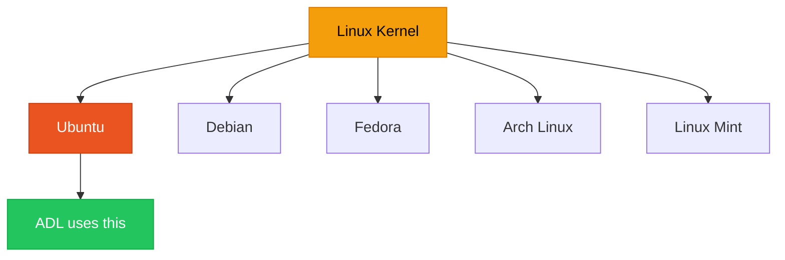
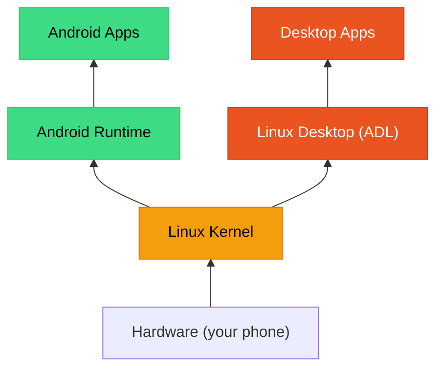

# What is Linux?

<HeroImage
  image="hero-learn.webp"
  alt="Robot mascot reading a book about Linux concepts beside an Android phone"
/>

<SvgDiagram
  src="/img/diagrams/architecture/diagram-linux-stack.svg"
  alt="Hand-drawn stack diagram: Android at the bottom, then Termux, proot, Ubuntu, XFCE desktop, and applications on top, with an arrow noting each layer runs on the one below"
  caption="The ADL Linux stack — sketchbook view"
/>

{/* TODO: this hero is intended for the Learn section landing page (currently a generated index). Move it there if a real landing page is created later */}

Linux is a **free, open-source operating system** that powers everything from web servers to smartphones. If you are using an Android phone right now, you are already running Linux — Android is built on top of the Linux kernel.

Understanding Linux is the first step to understanding how ADL works. This page explains what Linux is, why it matters, and why it makes running a desktop on your phone possible.

## What is an Operating System?

An operating system (OS) is the software that manages your device's hardware and provides a platform for applications to run. Think of it as the foundation of your device:

| What you see | What the OS does behind the scenes |
|---|---|
| You tap an app icon | The OS launches the program and allocates memory |
| You type on the keyboard | The OS sends your keystrokes to the right application |
| You save a file | The OS writes data to storage and manages the file system |
| You connect to Wi-Fi | The OS communicates with the wireless hardware |

Every computing device needs an operating system. The most common ones are:

| Operating System | Used On | Made By |
|---|---|---|
| Windows | PCs and laptops | Microsoft |
| macOS | MacBooks and iMacs | Apple |
| Android | Phones and tablets | Google |
| iOS | iPhones and iPads | Apple |
| Linux | Servers, PCs, embedded devices | Community (open source) |

## Kernel vs. Distribution

Linux is actually two things, and understanding the difference is important.

### The Linux Kernel

The **kernel** is the core of the operating system. It talks directly to your hardware — the processor, memory, storage, screen, and network. The kernel is what Linus Torvalds created in 1991, and it is what all Linux systems share.

Think of the kernel like the engine of a car. You never interact with it directly, but nothing works without it.

### Linux Distributions

A **distribution** (or "distro") takes the Linux kernel and adds everything else you need: a desktop interface, a web browser, a file manager, a text editor, system tools, and more. A distribution is a complete, ready-to-use operating system.

Think of distributions like car models. They all have engines (the kernel), but they look different, have different features, and target different users:

| Distribution | Best For | Character |
|---|---|---|
| Ubuntu | Beginners, general use | User-friendly, well-documented |
| Debian | Stability, servers | Rock-solid, conservative updates |
| Fedora | Developers, newest features | Cutting-edge, well-tested |
| Arch Linux | Advanced users | DIY, total control |
| Linux Mint | Windows switchers | Familiar, comfortable |

ADL uses **Ubuntu** as its distribution. We cover why in the [What is Ubuntu?](./what-is-ubuntu.md) page.

## Android IS Linux

Here is the key insight that makes ADL possible: **Android is built on the Linux kernel**. Your Android phone is already running Linux right now.

When you install ADL, you are not replacing Android. You are adding a Linux desktop **alongside** Android, sharing the same kernel. This is why:

- **It does not void your warranty** — you are not modifying the phone's system
- **It does not require root** — you work within Android's existing permissions
- **It runs natively** — programs run on the real Linux kernel, not through emulation
- **Performance is good** — there is no heavy translation layer slowing things down

## What is Open Source?

Linux is **open source**, which means:

1. **The source code is public** — anyone can read, study, and understand exactly how it works
2. **Anyone can contribute** — thousands of developers worldwide improve Linux
3. **It is free to use** — you never pay for Linux itself
4. **It is free to modify** — you can customize it however you want
5. **No single company controls it** — it is maintained by a global community

This matters for ADL because every piece of software in the stack — from Termux to Ubuntu to XFCE — is open source. You are not locked into any company's ecosystem.

<Tip>
Open source does not mean "no support." Ubuntu has a company behind it (Canonical) that provides professional support, and the Linux community has extensive documentation, forums, and help channels.
</Tip>

## Comparing Linux to Other Operating Systems

| Feature | Windows | macOS | Linux | Android |
|---|---|---|---|---|
| Cost | $100-200 | Free (with hardware) | Free | Free (with hardware) |
| Source Code | Closed | Closed | Open | Partially open |
| Customization | Limited | Limited | Unlimited | Moderate |
| Hardware Support | Broad (PCs) | Apple only | Very broad | Mobile devices |
| Software Library | Huge | Large | Large | App stores |
| Desktop Environments | One (Windows Shell) | One (Aqua) | Many choices | One (launcher) |
| Package Manager | None built-in | None built-in | Yes (APT, etc.) | Play Store |
| Terminal Access | PowerShell, CMD | Terminal.app | Full access | Limited |
| User Control | Moderate | Moderate | Complete | Limited |

## Why Linux Matters for ADL

Linux is what makes the entire ADL project possible:

1. **Shared kernel** — Android and Linux desktop apps can coexist because they speak the same language
2. **Mature software ecosystem** — decades of desktop software are available
3. **Lightweight options** — Linux desktop environments can run well on mobile hardware
4. **Open source** — every component can be adapted for the Android environment
5. **Active community** — problems get solved and software keeps improving

## Advantages of Linux

- **Free** — no license costs, ever
- **Secure** — strong permission model, fewer malware targets
- **Customizable** — change anything about your system
- **Lightweight** — can run well on limited hardware (perfect for phones)
- **Stable** — Linux servers run for years without rebooting
- **Private** — no built-in telemetry or forced accounts
- **Well-documented** — extensive community documentation

## Disadvantages of Linux

- **Learning curve** — some tasks require terminal commands
- **Software compatibility** — some Windows/Mac apps are not available (though alternatives exist)
- **Hardware support** — some specialized hardware lacks Linux drivers
- **Fragmentation** — many distributions and desktop environments can be confusing for newcomers

<Note>
Most of these disadvantages are less relevant for ADL. Since you are running Linux alongside Android, you still have access to all your Android apps. Linux fills in the gaps where Android falls short — productivity, development, and desktop workflows.
</Note>

<FAQ items={[
  {
    question: "Is Linux free?",
    answer: "Yes, completely free. Linux itself is open source and costs nothing. The applications you install on Linux are also overwhelmingly free. There are no license fees, no subscriptions, and no activation keys. Some companies sell support contracts for Linux, but the software itself is always free."
  },
  {
    question: "Is Linux hard to use?",
    answer: "Modern Linux with a desktop environment like XFCE is similar to using Windows or macOS. You have a taskbar, windows, a file manager, and a web browser. You can do most things by clicking, just like on any other operating system. The terminal is available for advanced tasks, but you do not need it for everyday use. ADL's setup process handles the complex parts for you."
  },
  {
    question: "Will Linux damage my phone?",
    answer: "No. ADL runs Linux inside a container on top of Android. It does not modify your phone's system, does not require root access, and does not touch your bootloader or firmware. You can uninstall it completely at any time, and your phone will be exactly as it was before. It is as safe as installing any other app from F-Droid."
  },
  {
    question: "Do I need to know programming to use Linux?",
    answer: "Not at all. While Linux is popular with programmers, it is a general-purpose operating system. You can browse the web, write documents, manage files, and watch videos without writing a single line of code. The ADL setup scripts handle the technical details."
  }
]} />

## Summary

Linux is a free, open-source operating system kernel that powers everything from the world's largest servers to the phone in your pocket. Because Android already uses the Linux kernel, we can run a full Linux desktop on your phone without emulation or modification. This shared foundation is what makes ADL possible.

**Next:** Learn about [Termux](./what-is-termux.md), the app that lets you access Linux tools on Android.
