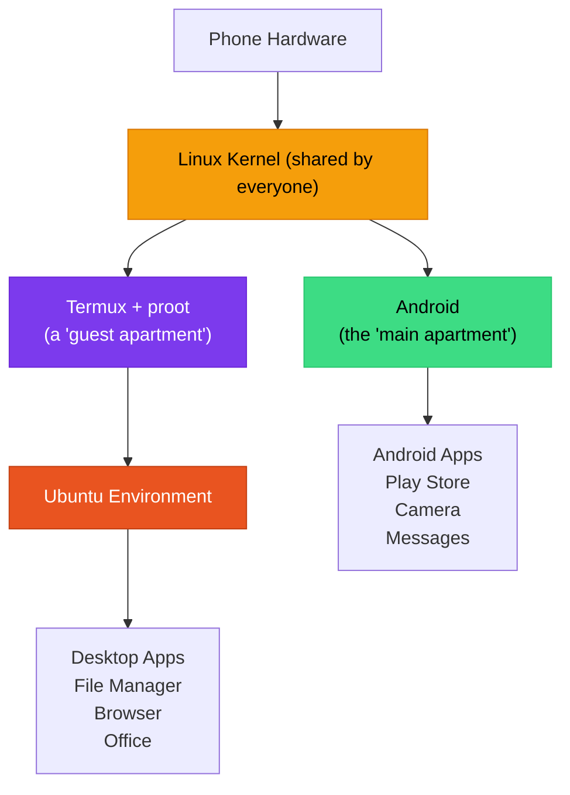
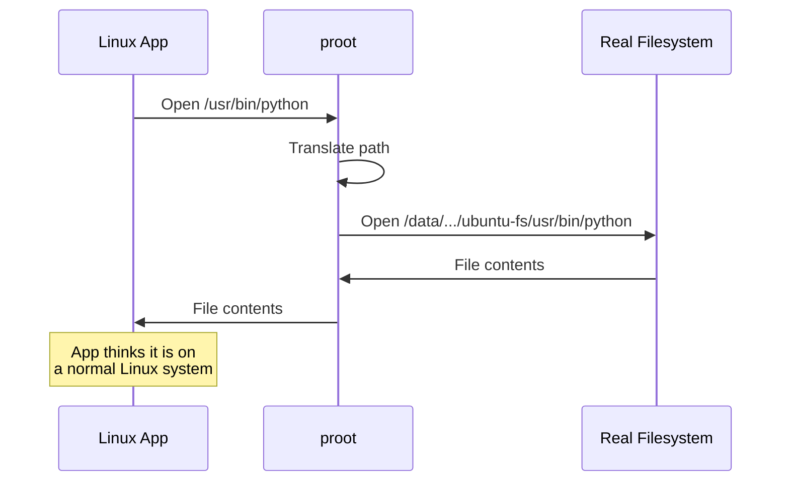
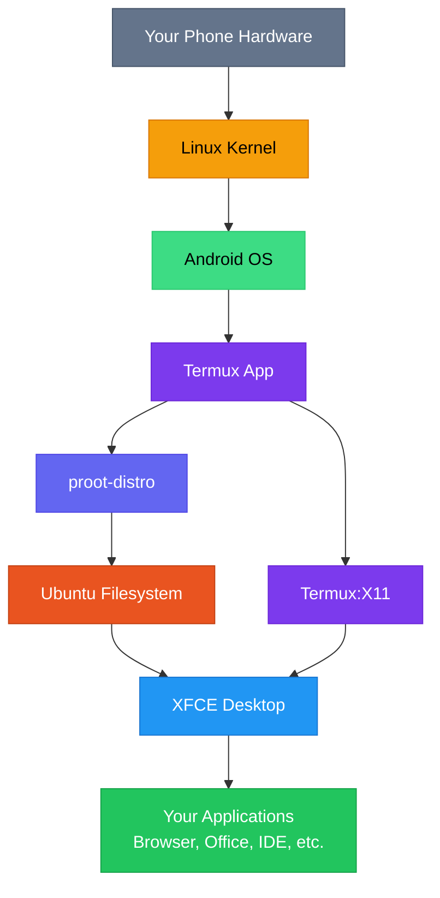

# What is proot?

<SvgDiagram
  src="/img/diagrams/concepts/diagram-what-is-proot.svg"
  alt="Hand-drawn diagram of Ubuntu running inside a dashed proot boundary within Android, with a padlock noting the warranty stays intact"
  caption="A protected workspace inside Android — no root"
/>

**proot** is a program that lets you run a complete Linux distribution on your Android phone without needing root (administrator) access. It works by intercepting system calls and translating them so that programs believe they are running on a real Linux computer.

In the ADL stack, proot is the layer that makes it possible to run Ubuntu and a full desktop environment inside Termux.

<StackDiagram />

## Understanding Containers First

Before explaining proot, let us talk about containers, because proot creates something similar.

Think of an **apartment building**:

- The **building** is your Android phone
- The **building's foundation and structure** is the Linux kernel
- Each **apartment** is a separate environment with its own furniture, decoration, and layout
- **Residents** (programs) in each apartment think they have a complete home

A container works the same way. It creates an isolated environment where programs run with their own files, settings, and tools — but they all share the same underlying system (the kernel).

## What proot Actually Does

proot performs a clever trick called **filesystem translation**. Here is what happens:

1. A Linux program asks: "Where is `/usr/bin/python`?"
2. proot intercepts this request
3. proot translates it to the real location: `/data/data/com.termux/files/home/ubuntu-fs/usr/bin/python`
4. The program gets the file it asked for and never knows the difference

This means programs think they are running on a normal Linux system with the standard directory structure (`/usr`, `/etc`, `/home`, etc.), when in reality all their files are tucked away inside Termux's storage.

### Key Translations proot Performs

| What the program sees | What actually exists |
|---|---|
| `/` (root filesystem) | `~/ubuntu-fs/` inside Termux |
| `/home/user` | `~/ubuntu-fs/home/user` |
| `/usr/bin/...` | `~/ubuntu-fs/usr/bin/...` |
| `/etc/...` | `~/ubuntu-fs/etc/...` |
| User ID 0 (root) | Termux's regular user ID |

## Why No Root is Needed

On a traditional Linux system, installing and running a complete distribution requires **root access** (administrator privileges). Root lets you:

- Mount filesystems
- Change system files
- Create users
- Access hardware directly

Android phones do not give you root access by default (for good security reasons). proot solves this by **faking root**. When a program checks "am I root?", proot says "yes" — even though you are actually running as a regular user. This is safe because:

- proot cannot actually modify Android's system files
- All changes happen inside proot's contained environment
- Android's security sandbox remains intact
- Your phone's system is never touched

<Note>
proot's "fake root" is not a security risk. It only affects programs running inside the proot environment. It cannot grant real root access to Android or bypass any security protections. Think of it as playing pretend — the programs believe they are root, but they have no actual elevated privileges.
</Note>

## proot-distro: The Easy Way

While you could set up proot manually, the **proot-distro** tool makes it simple. proot-distro is a Termux package that automates downloading, installing, and managing Linux distributions.

### What proot-distro Handles For You

| Task | Without proot-distro | With proot-distro |
|---|---|---|
| Download a distribution | Find the right rootfs manually | `proot-distro install ubuntu` |
| Set up the filesystem | Extract and configure by hand | Automatic |
| Configure networking | Manual DNS and host setup | Automatic |
| Launch the environment | Long proot command with many flags | `proot-distro login ubuntu` |
| Manage multiple distros | Complex manual organization | Built-in support |
| Back up an environment | Manual tar commands | `proot-distro backup ubuntu` |
| Remove a distribution | Manual cleanup | `proot-distro remove ubuntu` |

### Common proot-distro Commands

| Command | What it does |
|---|---|
| `proot-distro list` | Shows available distributions |
| `proot-distro install ubuntu` | Installs Ubuntu |
| `proot-distro login ubuntu` | Enters the Ubuntu environment |
| `proot-distro login ubuntu -- <cmd>` | Runs a single command in Ubuntu |
| `proot-distro backup ubuntu` | Creates a backup archive |
| `proot-distro restore ubuntu` | Restores from a backup |
| `proot-distro remove ubuntu` | Removes the distribution |
| `proot-distro reset ubuntu` | Resets to a fresh install |

<BestPractice>
Back up your proot-distro environment regularly using `proot-distro backup ubuntu`. This creates a compressed archive of your entire Ubuntu installation that you can restore if anything goes wrong. Store backups on your phone's shared storage or an SD card.
</BestPractice>

## Performance

proot does add some overhead because it intercepts and translates system calls. Here is what to expect:

### What Runs Well

- Web browsing
- Text editing and office applications
- Programming (writing and editing code)
- File management
- Media playback (using hardware-accelerated Android decoders)
- Terminal-based applications

### What Runs Slower

- **I/O-heavy operations** — file copying, package installation, and database operations are slower because every file access goes through proot's translation layer
- **Compilation** — building large software projects takes longer due to the overhead on thousands of small file operations
- **Disk-intensive applications** — anything that reads or writes many files frequently

### Typical Performance Impact

| Operation | Native Speed | With proot | Slowdown |
|---|---|---|---|
| CPU computation | 100% | ~95-100% | Minimal |
| Memory access | 100% | ~100% | None |
| File read/write | 100% | ~50-70% | Noticeable |
| Package installation | 100% | ~40-60% | Significant |
| Application launch | 100% | ~60-80% | Moderate |

<Tip>
CPU-intensive tasks (calculations, rendering, encoding) run at near-native speed because proot only intercepts system calls, not actual computation. If your workload is primarily CPU-bound, you will not notice much difference.
</Tip>

## The Full ADL Stack

Here is how proot fits into the complete ADL architecture:

## Alternatives to proot

proot is not the only way to run Linux on Android. Here are the alternatives and why ADL chose proot:

### chroot

**chroot** (change root) does a similar job to proot but works at the kernel level. It is faster because there is no system call interception.

- **Advantage:** Better performance, especially for I/O
- **Disadvantage:** Requires root access, which means unlocking your bootloader and potentially voiding your warranty
- **Best for:** Users who have already rooted their phone

### Full Virtual Machine

A virtual machine (VM) emulates an entire computer, including a virtual CPU.

- **Advantage:** Complete isolation, can run any operating system
- **Disadvantage:** Very slow on mobile devices, high memory usage, poor battery life
- **Best for:** Users who need to run x86 Linux on an ARM phone (rare)

### Dual Boot

Some Android phones can be configured to dual-boot Android and Linux.

- **Advantage:** Native performance, full hardware access
- **Disadvantage:** Risky (can brick your device), requires unlocked bootloader, limited device support
- **Best for:** Advanced users with supported devices and a tolerance for risk

### Direct Install (replacing Android)

Some projects let you replace Android entirely with Linux.

- **Advantage:** Full native Linux experience
- **Disadvantage:** Lose Android entirely, very limited device support, most phone features stop working
- **Best for:** Dedicated Linux phone enthusiasts

<Decision
  question="Which method should I use to run Linux on Android?"
  options={[
    {
      label: "proot (via Termux and proot-distro)",
      description: "No root required, safe, easy to set up, good performance for most tasks. Slight I/O overhead. This is what ADL uses.",
      recommended: true
    },
    {
      label: "chroot (requires root)",
      description: "Better I/O performance than proot, but requires rooting your phone. If you already have root, this can be a good option. Not covered by ADL.",
      recommended: false
    },
    {
      label: "Virtual Machine",
      description: "Too slow for practical use on most phones. Only consider if you specifically need x86 emulation.",
      recommended: false
    },
    {
      label: "Dual Boot",
      description: "Risky and limited device support. Only for advanced users who fully understand the risks of modifying their phone's boot configuration.",
      recommended: false
    },
    {
      label: "Replace Android",
      description: "Lose all Android functionality. Very few devices supported. Only for dedicated Linux phone projects like PinePhone.",
      recommended: false
    }
  ]}
/>

<CommonMistake>
Do not confuse proot with rooting your phone. **proot** is a user-space tool that fakes root access inside a container. **Rooting** means actually gaining superuser access to your phone's entire system. proot is safe and reversible; rooting can void your warranty and create security risks.
</CommonMistake>

## Frequently Asked Questions

<FAQ items={[
  {
    question: "Does proot modify my phone's system?",
    answer: "No. proot operates entirely within Termux's storage area. It never touches Android's system files, your bootloader, or any protected areas of your phone. Everything proot creates lives inside the Termux app's data directory."
  },
  {
    question: "Can I run multiple distributions with proot?",
    answer: "Yes. proot-distro supports installing multiple distributions side by side. You could have Ubuntu, Debian, and Fedora all installed at once and switch between them. Each distribution has its own isolated filesystem."
  },
  {
    question: "Is proot the same as Docker?",
    answer: "They solve similar problems (running isolated environments) but work very differently. Docker uses Linux kernel features (namespaces, cgroups) that require root. proot works in user space by intercepting system calls. Docker is more efficient but cannot run without root. proot is slower but works anywhere."
  },
  {
    question: "Why is package installation slow in proot?",
    answer: "Installing packages involves thousands of small file operations (extracting archives, copying files, updating databases). Each file operation goes through proot's system call translation, adding overhead. The actual programs run at near-native speed once installed — the slowdown is primarily during installation."
  },
  {
    question: "Can I access my Android files from inside proot?",
    answer: "Yes, with some setup. Termux can access Android's shared storage (after running termux-setup-storage), and this storage can be mounted inside the proot environment. ADL's setup scripts typically configure this for you."
  }
]} />

## Summary

proot is the technology that lets you run a complete Linux distribution on your Android phone without root access. It works by intercepting system calls and translating file paths, creating an isolated environment where programs believe they are running on a normal Linux system. Combined with proot-distro for easy management, it provides a practical and safe way to run Ubuntu and a full desktop on your phone.

**Next:** Learn about [Ubuntu](./what-is-ubuntu.md), the Linux distribution that ADL uses.
