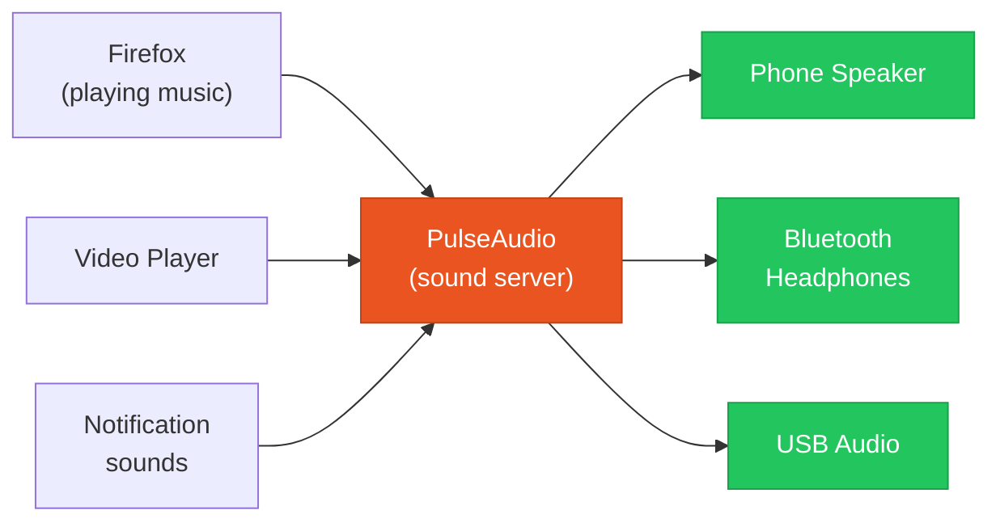
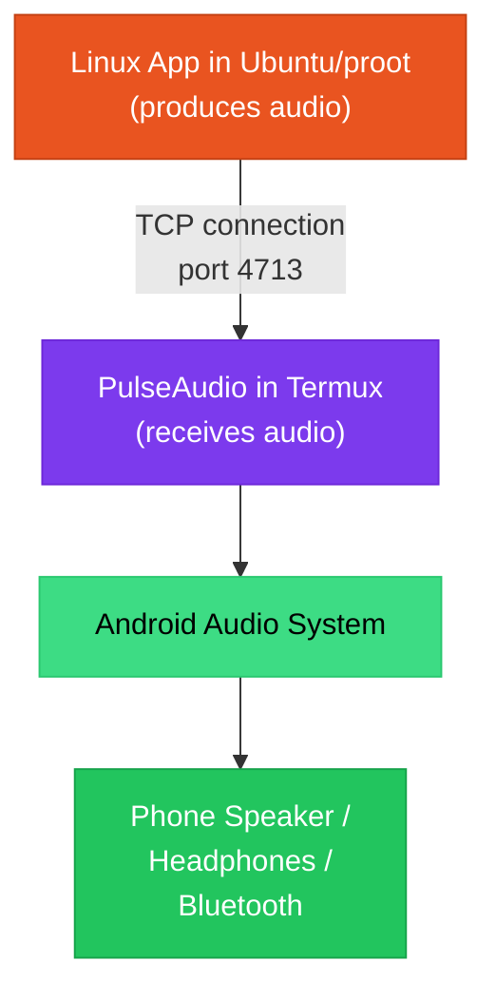

# What is PulseAudio?

PulseAudio is a **sound server** -- a program that manages audio on Linux. It sits between your applications (music players, browsers, video players) and your actual audio hardware (speakers, headphones, Bluetooth devices), routing sound from where it is produced to where you want to hear it.

In ADL, PulseAudio solves a specific problem: your Linux applications run inside Ubuntu through proot, but your phone's speakers and audio hardware are controlled by Android. PulseAudio bridges that gap.

## What a Sound Server Does

Without a sound server, each application would need to talk directly to the audio hardware. That creates problems:

- Only one application could play sound at a time
- There would be no system-wide volume control
- Switching audio output (speakers to headphones) would require restarting applications
- Different applications might conflict over audio access

A sound server acts as a central hub:

PulseAudio mixes audio from all applications together, applies volume adjustments, and sends the combined output to your chosen audio device.

## How Audio Works in ADL

The ADL audio architecture has a unique challenge. Your Linux applications are running inside Ubuntu (through proot inside Termux), but they cannot directly access the phone's audio hardware because proot does not provide real hardware access.

The solution uses a **TCP connection over localhost** (the phone's internal network):

1. **PulseAudio runs inside Termux** (the Android side), where it can access the phone's audio hardware
2. **Applications in Ubuntu** are configured to send audio to a PulseAudio server at `127.0.0.1` (localhost) on a specific port
3. **PulseAudio in Termux** receives the audio data and plays it through Android's audio system

### The TCP Localhost Connection

The key architectural detail is the TCP connection. Here is what happens step by step:

1. PulseAudio starts in Termux and listens on TCP port 4713 at address `127.0.0.1`
2. Inside the proot Ubuntu environment, the `PULSE_SERVER` environment variable is set to `tcp:127.0.0.1:4713`
3. When a Linux application plays audio, it connects to that address
4. Audio data flows over this local TCP connection from the proot environment to Termux
5. PulseAudio in Termux outputs the audio through Android

This works because `127.0.0.1` (localhost) is shared between Termux and the proot environment -- they are on the same device, so local network connections work seamlessly.

<Note>
The TCP connection adds negligible latency. Since the data never leaves your phone (it goes from one process to another on the same device), the delay is imperceptible. Audio playback sounds normal.
</Note>

## Setting Up Audio

The ADL setup guides walk through audio configuration step by step. If you need to set it up manually or troubleshoot, here are the key pieces:

### Termux Side (PulseAudio Server)

In Termux, PulseAudio needs to be installed and started:

<CopyCommand command="pkg install pulseaudio" />

To start PulseAudio listening on TCP:

<CopyCommand command="pulseaudio --start --load='module-native-protocol-tcp auth-ip-acl=127.0.0.1 auth-anonymous=1' --exit-idle-time=-1" />

### Ubuntu Side (Client Configuration)

Inside the proot Ubuntu environment, applications need to know where to send audio:

<CopyCommand command="export PULSE_SERVER=tcp:127.0.0.1:4713" />

This variable is usually set in the startup script that launches your desktop.

<CommonMistake>
If you have no audio, the most common cause is that PulseAudio is not running in Termux. Before troubleshooting inside Ubuntu, switch to the Termux terminal and verify PulseAudio is active with `pulseaudio --check`. If it returns an error, restart it with the command above.
</CommonMistake>

## Volume Control

Once PulseAudio is working, you can control volume at multiple levels:

| Level | How to Adjust | What It Affects |
|---|---|---|
| **Android volume** | Phone's physical volume buttons | Master output level |
| **PulseAudio system volume** | `pavucontrol` in Ubuntu, or XFCE volume plugin | All Linux audio |
| **Per-application volume** | `pavucontrol` Playback tab | Individual application volume |
| **Application-internal** | Volume controls within the app itself | Only that app |

`pavucontrol` (PulseAudio Volume Control) is a graphical tool that gives you full control over audio routing and volume levels. Install it inside Ubuntu:

<CopyCommand command="sudo apt install pavucontrol" />

## Troubleshooting Audio

| Symptom | Likely Cause | Fix |
|---|---|---|
| No sound at all | PulseAudio not running in Termux | Start PulseAudio in Termux |
| No sound at all | PULSE_SERVER not set in Ubuntu | Add `export PULSE_SERVER=tcp:127.0.0.1:4713` to your startup script |
| Sound is choppy | High CPU usage or buffer issues | Close some applications, or increase PulseAudio buffer size |
| Sound works then stops | PulseAudio crashed or was killed | Restart PulseAudio in Termux |
| Bluetooth audio not working | Android Bluetooth not connected | Connect Bluetooth device through Android settings first |

<Tip>
If audio was working and then stopped, Android may have killed the Termux PulseAudio process in the background. Switch to Termux and restart PulseAudio. Excluding Termux from battery optimization (Android Settings > Apps > Termux > Battery > Unrestricted) helps prevent this.
</Tip>

## PulseAudio vs. PipeWire

PipeWire is a newer audio (and video) server that is replacing PulseAudio on desktop Linux distributions. You may see references to it in Linux documentation.

| Feature | PulseAudio | PipeWire |
|---|---|---|
| Maturity | Stable, well-established | Newer, rapidly improving |
| Purpose | Audio only | Audio and video |
| ADL compatibility | Fully supported | Experimental in Termux |
| Configuration | Well-documented for ADL | Limited documentation for ADL |

For ADL, PulseAudio remains the recommended audio solution. PipeWire support in Termux is experimental and may require additional configuration.

<FAQ items={[
  {
    question: "Can I use Bluetooth headphones with ADL?",
    answer: "Yes. Connect your Bluetooth headphones through Android's Bluetooth settings. PulseAudio in Termux outputs audio through Android's audio system, so whatever audio device Android is using (speaker, wired headphones, or Bluetooth) will receive the Linux audio automatically."
  },
  {
    question: "Why does audio need a special setup?",
    answer: "Because Linux applications in proot cannot access the phone's audio hardware directly. The proot environment translates filesystem calls but does not provide direct hardware access. The TCP connection through PulseAudio is the bridge that gets audio from the isolated Linux environment to the phone's actual speakers."
  },
  {
    question: "Does microphone input work?",
    answer: "Microphone input is possible but requires additional PulseAudio configuration to route Android's microphone input back into the proot environment. This is not set up by default in most ADL configurations. Check the audio setup guide for instructions if you need microphone support."
  }
]} />

## Summary

PulseAudio is the sound server that routes audio from your Linux applications to your phone's speakers. In ADL, it works by running a PulseAudio server in Termux that listens on a local TCP port, while applications inside the Ubuntu proot environment send their audio to that port. This architecture bridges the gap between the isolated Linux environment and Android's audio hardware, giving you working sound in your Linux desktop.

**Next:** Learn about [package managers](./what-is-a-package-manager.md), which let you install software on your Linux system.

For the full audio setup walkthrough, see the [audio setup guide](/docs/installation/common/audio-setup).
