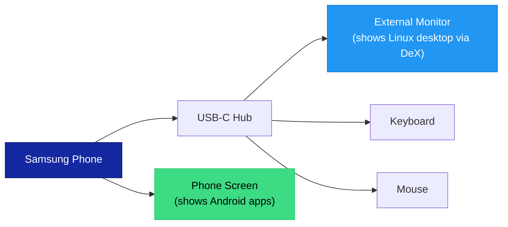

# What is Samsung DeX?

Samsung DeX is a feature built into Samsung Galaxy phones and tablets that provides a **desktop-like experience** when you connect an external monitor, keyboard, and mouse. When DeX activates, your phone's interface transforms into a layout with resizable windows, a taskbar, and a system tray -- similar to a traditional computer.

For ADL users, DeX is significant because it lets you display your Linux desktop on a full-sized external monitor while your phone screen remains available for Android apps.

## How DeX Works

When you connect a Samsung Galaxy phone to an external display (via USB-C cable, USB-C hub, or wirelessly), DeX provides a separate desktop interface on that external screen. Your phone screen continues to work independently -- you can use Android apps on the phone while the monitor shows a different view.

There are two connection methods:

| Method | How to Connect | Latency | Best For |
|---|---|---|---|
| **Wired (USB-C)** | USB-C to HDMI cable or USB-C hub | Very low | Daily use, productivity |
| **Wireless (Miracast)** | Samsung Smart TV or Miracast adapter | Moderate | Casual use, presentations |

<BestPractice>
Use a wired connection for ADL. Wireless DeX adds noticeable input lag that makes the Linux desktop feel sluggish. A USB-C to HDMI cable or a USB-C hub with HDMI output provides the best experience.
</BestPractice>

## DeX and ADL Together

The combination of Samsung DeX and ADL is where things get powerful. Here is the typical setup:

1. Connect your Samsung phone to an external monitor via USB-C
2. DeX activates on the external display
3. Launch Termux:X11 -- it opens as a DeX window on the monitor
4. Start your ADL Linux desktop inside Termux:X11
5. The Linux desktop fills the monitor at the monitor's native resolution
6. Connect a keyboard and mouse through the USB-C hub

The result is a full Linux desktop on a large screen, driven entirely by your phone. Your phone screen can simultaneously show Android apps, effectively giving you a dual-screen setup.

<Tip>
When Termux:X11 runs inside DeX, it can use the external monitor's full resolution. A 1080p or 1440p monitor provides a dramatically better experience than running on the phone's small screen. Text is easier to read, you can have more windows open, and the desktop feels like a real computer.
</Tip>

## Which Samsung Devices Support DeX

DeX is available on Samsung Galaxy flagships and some mid-range devices. The feature has expanded over the years:

| Device Series | DeX Support | Notes |
|---|---|---|
| Galaxy S8 / S8+ (2017) | Yes (wired only) | First DeX devices, required DeX Station |
| Galaxy S9 / S9+ (2018) | Yes (wired only) | Works with simple USB-C to HDMI |
| Galaxy S10 series (2019) | Yes (wired + wireless) | First with wireless DeX |
| Galaxy S20 series (2020) | Yes (wired + wireless) | Improved wireless DeX |
| Galaxy S21-S25 series | Yes (wired + wireless) | Best experience |
| Galaxy Note 8-20 | Yes | S Pen works in DeX mode |
| Galaxy Z Fold series | Yes | Large inner display also works well |
| Galaxy Tab S6 and later | Yes | Can use tablet screen directly as DeX display |
| Galaxy A52/A53/A54/A55 | Yes (some models) | Limited to wired DeX |

<Warning>
Budget Samsung phones (Galaxy A10, A20, A30 series) and most non-Samsung Android phones do not support DeX. If you do not have a Samsung phone, you can still use ADL -- you just display the Linux desktop directly through Termux:X11 on your phone screen, or use a separate HDMI-out solution if your phone supports video output.
</Warning>

## DeX Without ADL vs. DeX With ADL

DeX on its own provides a desktop-like layout for Android apps. Adding a Linux desktop by following ADL transforms it into something much more capable:

| Capability | DeX Alone | DeX + ADL |
|---|---|---|
| Desktop layout | Yes (Android apps in windows) | Yes (full Linux desktop) |
| File management | Android Files app | Thunar + terminal (full Linux filesystem) |
| Web browsing | Chrome/Samsung Internet | Firefox with desktop extensions |
| Office work | Google Docs / MS Office apps | LibreOffice (full desktop suite) |
| Programming | Limited (mobile code editors) | VS Code, vim, full compiler toolchains |
| Terminal access | None | Full Linux terminal with thousands of tools |
| Package management | Play Store only | APT with tens of thousands of packages |
| Multi-window | Yes (Android windows) | Yes (Linux windows with workspace support) |

## Setting Up DeX for ADL

The basic setup involves:

1. **Get a USB-C hub** with at least HDMI output, USB-A ports (for keyboard and mouse), and power delivery (to charge your phone while using DeX)
2. **Connect the hub** to your phone and the monitor
3. **DeX should activate automatically** -- if not, check Settings > Connected devices > Samsung DeX
4. **Launch Termux** and then Termux:X11 as you normally would
5. **Termux:X11 opens on the monitor** as a DeX window -- maximize it for a full-screen Linux desktop

<Note>
You do not need to change any ADL configuration for DeX. Termux:X11 automatically detects the display resolution and adjusts accordingly. The Linux desktop scales to fill whatever display is available.
</Note>

## Recommended Hardware

For the best DeX + ADL experience:

| Component | Recommendation | Why |
|---|---|---|
| **USB-C Hub** | Hub with HDMI + USB-A + PD charging | All-in-one connectivity |
| **Monitor** | 1080p or higher, any size | Higher resolution means more workspace |
| **Keyboard** | Any USB or Bluetooth keyboard | USB through the hub is most reliable |
| **Mouse** | Any USB or Bluetooth mouse | USB through the hub avoids pairing issues |
| **Phone** | Galaxy S21 or newer, 8GB+ RAM | More RAM means smoother multitasking |

For detailed hardware recommendations, see the [recommended setup](/docs/learn/hardware/recommended-setup) and [USB-C hubs](/docs/learn/hardware/usb-c-hubs) guides.

<FAQ items={[
  {
    question: "Do I need Samsung DeX to use ADL?",
    answer: "No. DeX is optional. You can use ADL entirely on your phone screen through Termux:X11 without an external monitor. DeX simply provides a better experience by giving you a larger display and proper keyboard and mouse input. Non-Samsung phones can use ADL just fine."
  },
  {
    question: "Can I use DeX wirelessly with ADL?",
    answer: "Yes, but it is not recommended for productivity. Wireless DeX adds input latency that makes typing and mouse interaction feel delayed. For casual browsing it is acceptable, but for real work, use a wired connection."
  },
  {
    question: "Does DeX affect ADL performance?",
    answer: "DeX itself uses some system resources to manage the desktop mode, but the impact is minimal. The main performance factor is your phone's RAM and processor. Running at a higher resolution on an external monitor requires slightly more from the graphics pipeline, but the difference is negligible on modern Samsung flagships."
  },
  {
    question: "Can I use a non-Samsung phone with an external monitor?",
    answer: "Some non-Samsung phones support USB-C video output (DisplayPort Alt Mode), which lets you mirror or extend your screen to a monitor. This is not DeX, but it works with Termux:X11. Check your phone's specifications for DisplayPort Alt Mode or HDMI output support."
  }
]} />

## Summary

Samsung DeX transforms your phone into a desktop computer by providing a full desktop interface on an external monitor. When combined with ADL, it lets you run a Linux desktop on a big screen with a keyboard and mouse, creating a genuine desktop computing experience powered entirely by your phone. While DeX is not required for ADL, it provides the most comfortable and productive setup for daily use.

**Next:** Learn about [display protocols](./what-is-wayland.md) and how your Linux desktop actually appears on screen.

For the full DeX setup and configuration guide, see the [DeX overview](/docs/samsung/dex-overview).
