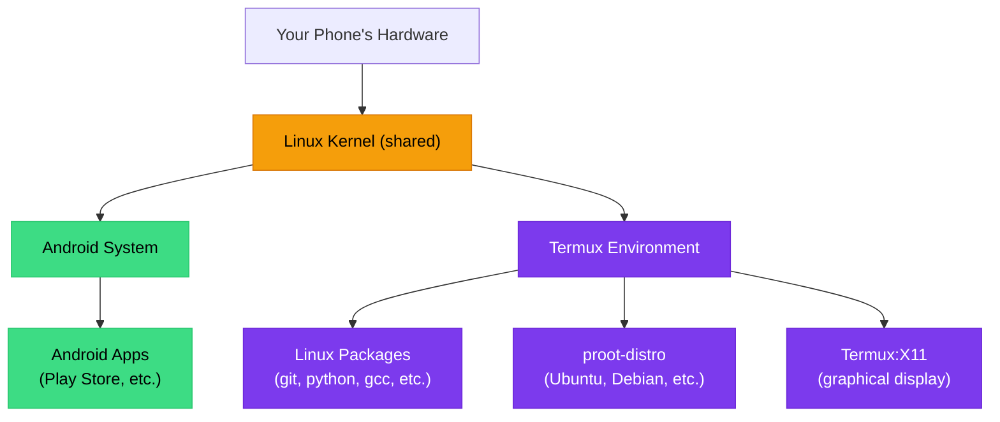
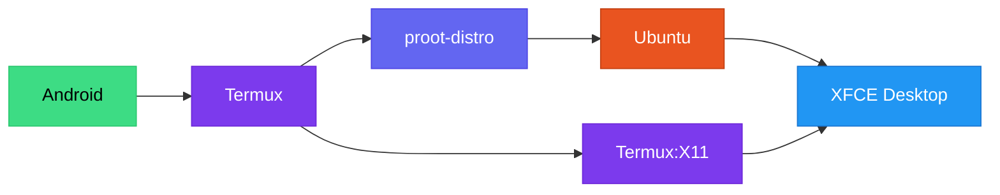

# What is Termux?

Termux is a **free, open-source terminal emulator and Linux environment** for Android. It gives you access to a real Linux command line and thousands of Linux packages — directly on your phone, without rooting.

In the ADL stack, Termux is the foundation layer. It is the app that makes everything else possible.

## What is a Terminal?

Before understanding Termux, you need to understand what a terminal is.

A terminal is a **text-based interface** to control your computer. Instead of tapping icons and clicking buttons, you type commands. Think of it like a text message conversation with your computer:

| You type | The computer does |
|---|---|
| `ls` | Lists files in the current folder |
| `cd Documents` | Opens the Documents folder |
| `cp report.pdf backup/` | Copies a file to the backup folder |
| `apt install firefox` | Downloads and installs Firefox |

Terminals might look old-fashioned, but they are incredibly powerful. Every operating system has one — Windows has PowerShell, macOS has Terminal.app, and Linux has many terminal applications. Terminals let you:

- **Automate tasks** — write scripts that do repetitive work for you
- **Work faster** — many operations are quicker to type than to click
- **Access everything** — some system functions are only available through the terminal
- **Work remotely** — manage servers and systems from anywhere

<Tip>
Think of a terminal like a text-based remote control for your computer. Instead of pressing buttons, you type commands. The result is the same — you are controlling the computer — but with more precision and power.
</Tip>

## Why Termux?

Several terminal apps exist for Android. Here is why Termux is the right choice:

| Feature | Termux | Other Terminal Apps |
|---|---|---|
| Real Linux packages | Yes (APT package manager) | No (limited built-in commands) |
| Package count | 2000+ packages | Handful of utilities |
| Native execution | Runs on the real CPU | Some use emulation |
| Root required | No | Some require root |
| Active development | Yes, actively maintained | Many are abandoned |
| Community | Large, active community | Small or none |
| proot support | Full support | Limited or none |
| X11 support | Yes (Termux:X11) | No |
| Open source | Yes (GPL) | Varies |

## How Termux Works

Termux is not an emulator. It does not simulate a Linux computer. Instead, it runs Linux programs **natively** on your phone's processor, using Android's own Linux kernel.



Here is what makes this special:

1. **Native execution** — Programs run directly on your ARM processor, just like any Android app
2. **Shared kernel** — Termux uses the same Linux kernel as Android (because Android IS Linux)
3. **User-space isolation** — Termux runs in its own directory, separate from Android's system files
4. **No root needed** — Everything runs within Android's normal user permissions

## The Termux Ecosystem

Termux is more than just one app. It is a family of related applications:

| App | Purpose | Needed for ADL? |
|---|---|---|
| **Termux** | Core terminal and package manager | Yes (required) |
| **Termux:X11** | Graphical display server | Yes (required) |
| **Termux:API** | Access Android features (camera, sensors, etc.) | Optional |
| **Termux:Widget** | Home screen shortcuts for scripts | Optional |
| **Termux:Styling** | Customize terminal appearance | Optional |
| **Termux:Boot** | Run scripts on device boot | Optional |
| **Termux:Float** | Floating terminal window | Optional |

For ADL, you need **Termux** and **Termux:X11**. The others are optional enhancements.

<Warning>
**Only install Termux from F-Droid or GitHub.** The Google Play Store version of Termux is outdated and no longer maintained. It will not work correctly with ADL. Always use the F-Droid version or download directly from the Termux GitHub releases page.
</Warning>

## Advantages of Termux

### No Root Required
Termux runs entirely within Android's normal user permissions. You do not need to unlock your bootloader, flash custom firmware, or void your warranty. Install it like any other app.

### Real Package Manager
Termux includes APT, the same package manager used by Debian and Ubuntu. You can install thousands of real Linux packages:

```bash
pkg install git python nodejs rust golang
```

### Native Performance
Because Termux runs programs natively (not through emulation), performance is excellent. Your compiled code runs at full speed on your phone's processor.

### Active Development
Termux is actively maintained with regular updates. The community is large and helpful, and issues get addressed promptly.

### Excellent Hardware Support
Termux works on virtually all Android devices running Android 7 or later. It supports both ARM and x86 processors.

## Disadvantages of Termux

### Android Sandbox Limitations
Android restricts what apps can do for security reasons. This means Termux cannot:

- Access system directories without proot
- Run services that listen on low-numbered ports (below 1024) without workarounds
- Directly access some hardware features
- Run as a true system service

### Storage Restrictions
On newer Android versions, Termux has limited access to shared storage due to Android's scoped storage policies. You may need to grant additional permissions.

### Background Process Limits
Android aggressively kills background processes to save battery. Long-running Termux processes may be terminated. You need to configure battery optimization exclusions for Termux.

<BestPractice>
Always exclude Termux from battery optimization in your Android settings. Go to **Settings > Apps > Termux > Battery > Unrestricted**. This prevents Android from killing your Linux session while it is running.
</BestPractice>

### No Init System
Termux does not have a traditional init system (like systemd). Services must be started manually or through scripts.

## Termux vs. Alternatives

<Decision
  question="Which terminal environment should I use on Android?"
  options={[
    {
      label: "Termux (from F-Droid)",
      description: "Full Linux environment with 2000+ packages, proot support, X11 graphics, active community. Required for ADL.",
      recommended: true
    },
    {
      label: "Termux (Play Store)",
      description: "Outdated version that is no longer maintained. Do not use — packages will fail to install and ADL will not work.",
      recommended: false
    },
    {
      label: "UserLAnd",
      description: "Simpler but more limited. Fewer packages, less control, less active development. Not compatible with ADL.",
      recommended: false
    },
    {
      label: "Andronix",
      description: "Commercial alternative with a simpler interface. Less flexible, not open source. Not compatible with ADL.",
      recommended: false
    },
    {
      label: "AIDE or Terminal Emulator apps",
      description: "Basic terminal access without a real package manager. Cannot run desktop Linux.",
      recommended: false
    }
  ]}
/>

## Key Termux Commands

Here are the most important Termux-specific commands:

| Command | What it does |
|---|---|
| `pkg update` | Updates the package list |
| `pkg upgrade` | Upgrades all installed packages |
| `pkg install <name>` | Installs a package |
| `pkg search <name>` | Searches for a package |
| `pkg list-installed` | Lists installed packages |
| `termux-setup-storage` | Grants access to shared storage |
| `termux-reload-settings` | Reloads Termux configuration |

<Note>
The `pkg` command is a Termux wrapper around APT that handles some Termux-specific details automatically. You can also use `apt` directly, but `pkg` is recommended within the Termux base environment.
</Note>

## How Termux Fits into ADL

In the ADL architecture, Termux is the bridge between Android and your Linux desktop:



1. **Termux** provides the Linux environment and package manager
2. **proot-distro** (installed through Termux) creates a container for Ubuntu
3. **Ubuntu** runs inside that container with a full desktop environment
4. **Termux:X11** displays the graphical desktop on your screen

Without Termux, none of the other layers would be possible on a non-rooted Android device.

<FAQ items={[
  {
    question: "Is Termux safe to install?",
    answer: "Yes. Termux is open source, well-audited, and widely used. It runs within Android's normal security sandbox and cannot access system files or other apps' data without explicit permission. It is as safe as any other well-maintained open-source application."
  },
  {
    question: "Will Termux slow down my phone?",
    answer: "Termux itself uses minimal resources when idle. It only uses significant CPU and memory when you are actively running programs. When not in use, it sits quietly in the background. You should exclude it from battery optimization, but this does not meaningfully increase battery drain when Termux is idle."
  },
  {
    question: "Can I use Termux without ADL?",
    answer: "Absolutely. Termux is a powerful standalone tool. Many developers use it for programming, system administration, and running scripts on Android without ever installing a desktop environment. ADL builds on Termux, but Termux is useful on its own."
  },
  {
    question: "What Android version do I need?",
    answer: "Termux requires Android 7.0 (Nougat) or later. For the best experience with ADL, Android 12 or later is recommended. Older Android versions may work but could have limitations."
  }
]} />

## Summary

Termux is the Android app that brings a real Linux environment to your phone without root. It provides a terminal, a package manager, and the foundation for running a complete Linux desktop. For ADL, Termux is the essential first layer — the bridge between Android and your desktop Linux experience.

**Next:** Learn about [proot](./what-is-proot.md), the technology that lets you run a full Linux distribution inside Termux.
