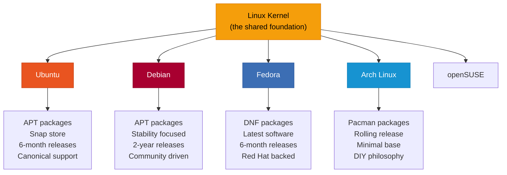

# What is Ubuntu?

Ubuntu is a **Linux distribution** — a complete operating system built on the Linux kernel. It is the most popular Linux distribution in the world, known for being user-friendly, well-documented, and widely supported. ADL uses Ubuntu as the foundation for your desktop experience.

## What is a Linux Distribution?

As explained in [What is Linux?](./what-is-linux.md), the Linux kernel is just the core of an operating system. A **distribution** (or "distro") packages the kernel together with everything else you need:

- A package manager for installing software
- System utilities for managing files, users, and settings
- Default applications (text editor, file manager, etc.)
- Configuration and sensible defaults
- Documentation and community support

Think of distributions like **flavors of ice cream**. The base ingredient (milk/cream) is the Linux kernel. Each flavor adds different ingredients, textures, and presentations — but they are all fundamentally ice cream.

## Why Ubuntu for ADL?

ADL chose Ubuntu for several important reasons:

### 1. Largest Community

Ubuntu has the largest user base of any Linux distribution. This means:

- More people have solved the problem you are encountering
- More tutorials, guides, and forum posts exist
- More questions have been answered on sites like Ask Ubuntu and Stack Overflow
- More eyes on bugs means faster fixes

### 2. Most Packages Available

Ubuntu's repositories contain over **60,000 packages**. If a piece of Linux software exists, it is almost certainly available for Ubuntu. This includes:

- Office suites (LibreOffice)
- Web browsers (Firefox, Chromium)
- Development tools (VS Code, Git, Python, Node.js)
- Media players (VLC, MPV)
- Graphics editors (GIMP, Inkscape)
- And thousands more

### 3. Best Documentation

Ubuntu has the most extensive documentation of any Linux distribution:

- Official Ubuntu documentation
- Community wiki
- Ask Ubuntu (Q&A site with millions of answers)
- Thousands of third-party tutorials
- Books and courses

When you search for how to do something on Linux, the Ubuntu answer is usually the first result.

### 4. ARM Support

Ubuntu has excellent support for ARM processors, which is the architecture used by virtually all Android phones. Many distributions have limited or experimental ARM support. Ubuntu's ARM packages are well-tested and maintained.

### 5. proot-distro Support

proot-distro has first-class support for Ubuntu. The Ubuntu rootfs (root filesystem) provided by proot-distro is well-tested and regularly updated.

### 6. LTS Releases

Ubuntu offers **Long Term Support (LTS)** releases every two years. LTS releases receive security updates for five years, giving you a stable and secure base. ADL uses the latest LTS release.

<BestPractice>
Always use an Ubuntu LTS release with ADL. LTS releases (like 24.04, 26.04) are tested more thoroughly, have longer support periods, and are more likely to have all the packages you need. Non-LTS releases are updated every six months and lose support after nine months.
</BestPractice>

## Ubuntu Version Numbering

Ubuntu uses a simple version numbering system: **Year.Month**

| Version | Release Date | Name | LTS? | Support Until |
|---|---|---|---|---|
| 22.04 | April 2022 | Jammy Jellyfish | Yes | April 2027 |
| 22.10 | October 2022 | Kinetic Kudu | No | July 2023 |
| 23.04 | April 2023 | Lunar Lobster | No | January 2024 |
| 23.10 | October 2023 | Mantic Minotaur | No | July 2024 |
| 24.04 | April 2024 | Noble Numbat | Yes | April 2029 |
| 24.10 | October 2024 | Oracular Oriole | No | July 2025 |
| 25.04 | April 2025 | Plucky Puffin | No | January 2026 |
| 26.04 | April 2026 | (TBD) | Yes | April 2031 |

<Note>
LTS versions (with .04 in even-numbered years) are always recommended for ADL. They provide the stability and long support window needed for a reliable desktop experience.
</Note>

## Comparing Distributions

Here is how Ubuntu compares to other distributions you might consider:

| Feature | Ubuntu | Debian | Fedora | Arch Linux | Linux Mint |
|---|---|---|---|---|---|
| **Difficulty** | Beginner | Intermediate | Intermediate | Advanced | Beginner |
| **Package Manager** | APT | APT | DNF | Pacman | APT |
| **Release Cycle** | 6 months (LTS: 2 years) | ~2 years | 6 months | Rolling | Follows Ubuntu LTS |
| **Software Freshness** | Moderate | Conservative | Cutting-edge | Latest | Moderate |
| **Community Size** | Very large | Large | Large | Medium | Large |
| **Documentation** | Excellent | Good | Good | Excellent | Good |
| **ARM Support** | Excellent | Good | Good | Good | Limited |
| **proot Compatibility** | Excellent | Good | Fair | Fair | Not tested |
| **Beginner Friendly** | Yes | Somewhat | Somewhat | No | Yes |
| **Commercial Support** | Canonical | No | Red Hat | No | No |

## Alternatives and When to Choose Them

### Debian

Debian is Ubuntu's parent distribution — Ubuntu is actually based on Debian. Debian prioritizes stability above all else.

**Choose Debian if:**

- You want an even more stable (but older) base
- You are experienced with Linux and do not need the latest packages
- You prefer a purely community-driven project

**Stick with Ubuntu if:**

- You are new to Linux
- You want more recent software versions
- You want the largest community support

### Fedora

Fedora is backed by Red Hat and features the latest Linux technologies. It uses the DNF package manager instead of APT.

**Choose Fedora if:**

- You specifically need cutting-edge Linux features
- You are familiar with RPM-based systems
- You want the newest kernel and desktop environment versions

**Stick with Ubuntu if:**

- You want better compatibility with online guides and tutorials
- You want APT (most Linux guides assume APT)
- You want better ARM support in proot

### Arch Linux

Arch Linux follows a "rolling release" model where software is continuously updated. It provides a minimal base that you build up yourself.

**Choose Arch if:**

- You are an experienced Linux user
- You want complete control over every package installed
- You enjoy learning by building your system from scratch

**Stick with Ubuntu if:**

- You want a system that works out of the box
- You want easier troubleshooting (more answers exist for Ubuntu)
- You do not want to spend time on system maintenance

<Decision
  question="Which Linux distribution should I use with ADL?"
  options={[
    {
      label: "Ubuntu (LTS)",
      description: "Largest community, best documentation, excellent ARM support, most packages. The default and recommended choice for ADL.",
      recommended: true
    },
    {
      label: "Debian",
      description: "More stable but older packages. Good if you are experienced and prefer conservative updates. Compatible with ADL but not the default.",
      recommended: false
    },
    {
      label: "Fedora",
      description: "Newer packages but uses DNF instead of APT. Less tested with proot. Only for users who specifically need Fedora.",
      recommended: false
    },
    {
      label: "Arch Linux",
      description: "Maximum control but requires significant Linux expertise. Possible with proot-distro but not supported by ADL documentation.",
      recommended: false
    }
  ]}
/>

## What Comes with Ubuntu in ADL?

When you install Ubuntu through proot-distro, you get a minimal base system. The ADL guides then walk you through installing additional packages to create a complete desktop environment. Here is what the layers look like:

### Base Ubuntu (from proot-distro)

- Core system utilities (ls, cp, mv, cat, etc.)
- APT package manager
- Basic networking tools
- User management tools

### Added by ADL Setup

- XFCE desktop environment
- Web browser (Firefox or Chromium)
- File manager (Thunar)
- Terminal emulator
- Text editor
- Audio support (PulseAudio)
- Fonts and themes
- Various utilities and tools

<Tip>
After ADL setup is complete, you can install any Ubuntu package using APT. If it is in the Ubuntu repositories, it will work. Run `apt search <name>` to find packages or visit packages.ubuntu.com to browse.
</Tip>

## The Ubuntu Package Ecosystem

Ubuntu's package ecosystem is one of its strongest features:

### Official Repositories

Ubuntu maintains four official repositories:

| Repository | Contents |
|---|---|
| **main** | Officially supported, open-source software |
| **universe** | Community-maintained open-source software |
| **restricted** | Proprietary drivers and firmware |
| **multiverse** | Software with legal or licensing restrictions |

In a proot environment, you will primarily use **main** and **universe**, which together contain tens of thousands of packages.

### PPAs (Personal Package Archives)

PPAs let developers distribute their own packages outside the official repositories. They are useful for getting newer versions of software or applications not yet in the official repos.

<Warning>
Be cautious with PPAs in a proot environment. Not all PPAs work correctly on ARM processors, and some may have dependencies that conflict with the proot setup. Stick to official repositories when possible.
</Warning>

<FAQ items={[
  {
    question: "Can I use Debian instead of Ubuntu?",
    answer: "Yes, proot-distro supports Debian. Since Ubuntu is based on Debian, most things will work the same way. However, ADL's documentation and examples are written for Ubuntu, so you may need to adapt some steps. Debian packages tend to be older than Ubuntu packages, which could mean missing features in some applications."
  },
  {
    question: "What version of Ubuntu does ADL use?",
    answer: "ADL uses the latest Ubuntu LTS release available through proot-distro. As of this writing, that is Ubuntu 24.04 LTS (Noble Numbat). When a new LTS is released and available in proot-distro, ADL will update to support it. You can check your version by running 'lsb_release -a' inside the Ubuntu environment."
  },
  {
    question: "Can I upgrade Ubuntu inside proot?",
    answer: "You can upgrade packages within the same release using 'apt update && apt upgrade'. However, upgrading to a new Ubuntu release (e.g., from 22.04 to 24.04) inside proot is not recommended. It is better to back up your data, remove the old installation, and install the new version fresh with proot-distro."
  },
  {
    question: "Is this the same Ubuntu as on a PC?",
    answer: "It is the same Ubuntu, but the ARM version (arm64/aarch64) instead of the x86_64 version used on most PCs. The package manager, commands, and system structure are identical. The only difference is that some software is not available for ARM, and some x86-only applications will not run. However, the vast majority of Ubuntu packages are available for ARM."
  }
]} />

## Summary

Ubuntu is the default Linux distribution the ADL guides build on. It was chosen for its unmatched combination of community size, documentation quality, package availability, and ARM support. When you follow the guides, you are running a real Ubuntu system — the same one used by millions of people worldwide on servers, desktops, and now, on your Android phone.

**Next:** Learn about [desktop environments](./what-is-a-desktop-environment.md), the graphical interface that makes Ubuntu look and feel like a traditional computer.
