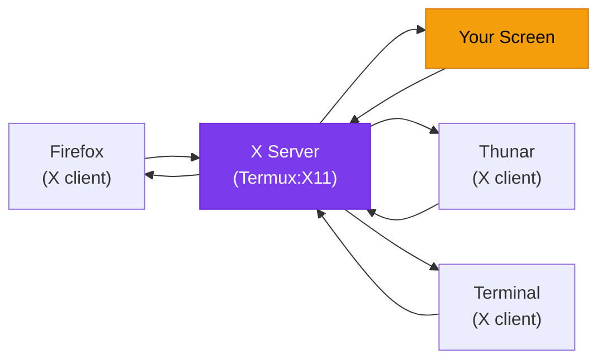
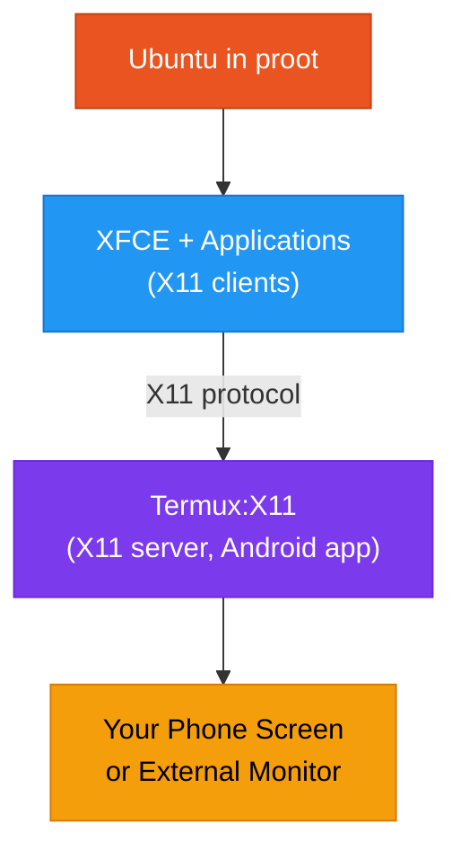

# What is Wayland?

To understand how your Linux desktop appears on screen in ADL, you need to understand **display protocols** -- the systems that let applications draw windows, buttons, and text on your display. This page explains what display protocols are, compares the two main ones (X11 and Wayland), and clarifies why ADL uses X11 despite the name "Termux:X11."

## What is a Display Protocol?

A display protocol is a set of rules that governs how applications communicate with the display server -- the software responsible for putting pixels on your screen.

Think of it this way:

- **Applications** are people who want to put up posters
- **The display server** is the person who controls the bulletin board
- **The display protocol** is the language they use to communicate ("put my poster here," "make it this size," "someone clicked on my poster")

Without a display protocol and a display server, your applications would have no way to show anything visual. The terminal would be all you have.

| Role | What It Does | ADL Example |
|---|---|---|
| Application | Wants to display a window | Firefox, Thunar, Mousepad |
| Display protocol | Rules for communication | X11 (used by ADL) |
| Display server | Manages the screen and input | Termux:X11 |
| Window manager | Arranges and decorates windows | xfwm4 (part of XFCE) |

## X11: The Established Standard

X11 (also called the X Window System, or simply X) is a display protocol created in 1984 at MIT. It has been the standard way to display graphical applications on Linux for nearly four decades.

### How X11 Works

X11 uses a **client-server model**:

1. The **X server** runs on the machine with the display (in ADL, this is Termux:X11)
2. **X clients** (applications) connect to the X server and send drawing commands
3. The X server renders everything on screen and sends input events (keyboard, mouse) back to the applications

### Strengths of X11

- **Mature and stable** -- nearly 40 years of development and bug fixes
- **Widely supported** -- virtually every Linux application supports X11
- **Network transparency** -- applications can run on one machine and display on another
- **Well-understood** -- extensive documentation and tooling

### Weaknesses of X11

- **Security model is outdated** -- any X11 application can see and interact with any other application's windows (keylogging, screenshot capture)
- **Complex codebase** -- decades of features have made the protocol large and complex
- **Compositing is bolted on** -- visual effects like transparency and shadows were added later, not designed in
- **Screen tearing** -- synchronizing display updates can be inconsistent

## Wayland: The Modern Replacement

Wayland is a newer display protocol started in 2008, designed from scratch to replace X11. It addresses many of X11's architectural problems.

### How Wayland Differs

| Aspect | X11 | Wayland |
|---|---|---|
| Age | 1984 | 2008 |
| Architecture | Separate server and compositor | Server and compositor combined |
| Security | Apps can see other apps' windows | Apps are isolated from each other |
| Performance | Good, with some overhead | Better, more direct rendering |
| Screen tearing | Possible | Eliminated by design |
| Network transparency | Built in | Not built in (requires extra tools) |
| Application support | Universal | Growing (most major apps support it) |
| Complexity | Very complex protocol | Simpler, more modern design |

### Where Wayland Stands Today

On desktop Linux PCs, Wayland is becoming the default. GNOME and KDE Plasma on recent versions of Ubuntu, Fedora, and other distributions use Wayland by default. However, some applications and tools still work better with X11, and the transition is ongoing.

## Why ADL Uses X11

Here is where it gets confusing: the ADL display app is called **Termux:X11**, and it uses the **X11 protocol**. This might seem backward when Wayland is the newer technology, but there are good reasons.

### Reason 1: Compatibility

X11 has near-universal application support. Every Linux desktop application, old or new, supports X11. Wayland support is widespread but not complete. Using X11 means you will never encounter an application that refuses to display.

### Reason 2: Architecture Fit

Termux:X11 works by running an X11 server inside an Android app. Applications running in the proot Ubuntu environment connect to this server to display their windows. This client-server model maps naturally to the ADL architecture, where the display (Android) and the applications (Ubuntu in proot) are in separate environments.

### Reason 3: Maturity in proot

Wayland compositors have specific kernel requirements (DRM/KMS access for direct rendering) that are not available inside a proot environment. X11's user-space rendering model works within proot's constraints without needing special kernel features.

<Note>
The name "Termux:X11" accurately describes what the app does -- it is an X11 server that runs as a Termux companion app. Despite Wayland being the future direction for desktop Linux, X11 remains the practical choice for the ADL use case. You do not need to worry about missing out on Wayland features. The desktop experience through Termux:X11 is complete and functional.
</Note>

## The DISPLAY Variable

When you launch the ADL desktop, an environment variable called `DISPLAY` is set. This tells applications where to find the X11 server.

In ADL, this is typically set to:

<CopyCommand command="export DISPLAY=:0" />

This means "connect to the X11 server on display number 0 on the local machine." Termux:X11 listens on this display, and all graphical applications use it to show their windows.

If your desktop is not appearing, the `DISPLAY` variable being unset or wrong is one of the most common causes.

<CommonMistake>
If you see errors like "cannot open display" or "no display specified," it usually means the DISPLAY environment variable is not set or Termux:X11 is not running. Make sure Termux:X11 is open on your phone and that your launch script sets the DISPLAY variable before starting the desktop environment.
</CommonMistake>

## VNC as an Alternative

Some ADL users use VNC (Virtual Network Computing) instead of Termux:X11. VNC is a different approach:

| Feature | Termux:X11 | VNC |
|---|---|---|
| Performance | Better (shared memory) | Slower (network-based, even locally) |
| Input handling | Native Android input | Translated through VNC client |
| Resolution | Matches device/monitor | Configurable, may need manual setup |
| Setup complexity | Simpler with ADL scripts | More configuration required |
| Sound | Separate (PulseAudio) | Separate (PulseAudio) |

For most users, Termux:X11 provides the better experience.

<FAQ items={[
  {
    question: "Should I switch to Wayland?",
    answer: "No. In the ADL environment, X11 through Termux:X11 is the supported and recommended display method. Wayland compositors have requirements that are difficult to meet inside proot. Stick with X11 for a reliable experience."
  },
  {
    question: "Will Termux:X11 be replaced by a Wayland solution?",
    answer: "There is ongoing experimentation with Wayland in the Termux ecosystem, but there is no production-ready replacement for Termux:X11 at this time. If a Wayland solution becomes viable, the ADL documentation will cover the transition."
  },
  {
    question: "Is X11 insecure?",
    answer: "X11's security model allows applications to observe each other, which is a concern on shared or public systems. In the ADL context, all applications are running in your personal proot environment on your own phone, so this is not a practical security issue. You control everything running on the display."
  }
]} />

## Summary

Display protocols are the communication systems that let applications show graphics on your screen. X11 is the established protocol with decades of support, while Wayland is the modern replacement gaining adoption on desktop Linux. ADL uses X11 through the Termux:X11 app because it offers universal compatibility, fits naturally into the proot architecture, and works reliably without special kernel features. For ADL users, X11 provides a complete, functional desktop display.

**Next:** Learn about [PulseAudio](./what-is-pulseaudio.md), which handles audio routing between your Linux desktop and your phone.

For detailed Termux:X11 setup and configuration, see the [Termux:X11 guide](/docs/learn/software/termux-x11).
