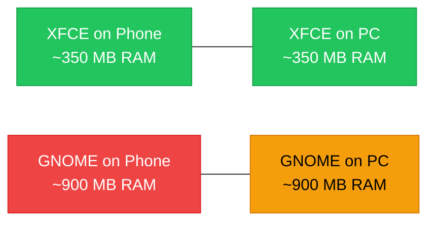

# What is XFCE?

XFCE (pronounced "ecks-fce") is a **lightweight, open-source desktop environment** for Linux. It gives you a full graphical interface -- windows, menus, a taskbar, a file manager -- while using far less memory and CPU than heavier alternatives like GNOME or KDE Plasma. This efficiency is why ADL recommends XFCE for running a Linux desktop on your phone.

## A Brief History

XFCE started in 1996 as a project to create a lightweight alternative to the CDE (Common Desktop Environment) used on commercial Unix systems. Over the decades, it has evolved into one of the most popular desktop environments for users who value speed and reliability over flashy animations.

Key milestones:

| Year | Event |
|---|---|
| 1996 | XFCE created by Olivier Fourdan |
| 2003 | XFCE 4.0 released, complete rewrite using GTK+ toolkit |
| 2007 | XFCE 4.4 brought desktop icons and a modern file manager |
| 2015 | XFCE 4.12, widely adopted as a stable lightweight option |
| 2020 | XFCE 4.14/4.16, modernized with GTK3 support |
| 2023 | XFCE 4.18, latest stable release with continued refinements |

XFCE has always had one guiding principle: provide a complete, usable desktop that does not waste your system's resources.

## Why XFCE for ADL

Your phone has real constraints. It is running Android, Termux, proot, and Ubuntu all at once before you even open a desktop application. Every megabyte of RAM that the desktop environment consumes is a megabyte your applications cannot use.

Here is how XFCE compares to the other major desktop environments:

| Desktop Environment | Idle RAM Usage | Startup Time | Disk Space | Best For |
|---|---|---|---|---|
| **XFCE** | 300-400 MB | Fast | ~500 MB | ADL (recommended) |
| **LXDE** | 200-300 MB | Very fast | ~350 MB | Extremely low-spec devices |
| **MATE** | 400-500 MB | Moderate | ~700 MB | Users who want more built-in tools |
| **KDE Plasma** | 500-800 MB | Slow | ~1.5 GB | Customization enthusiasts |
| **GNOME** | 700-1200 MB | Slow | ~1.8 GB | Modern touchscreen interfaces |

<PerformanceNote>
On a phone with 6 GB of RAM, GNOME would consume up to 20% of your total memory just for the desktop shell. XFCE uses roughly 5-7%. That difference translates directly into more browser tabs, more open documents, and smoother multitasking.
</PerformanceNote>

XFCE also handles ARM processors well. It avoids heavy GPU-dependent compositing effects that can cause rendering issues in the proot + Termux:X11 environment. The result is a desktop that feels responsive even on mid-range hardware.

## Key Components

XFCE is not a single program. It is a collection of components that work together to form a complete desktop. Understanding these components helps you troubleshoot issues and customize your experience.

### xfwm4 (Window Manager)

The window manager controls how application windows behave. It handles:

- Moving and resizing windows
- Minimizing, maximizing, and closing windows
- Window decorations (the title bar and buttons)
- Workspace switching (virtual desktops)
- Keyboard shortcuts for window management

### xfce4-panel (Panel)

The panel is the bar at the top or bottom of your screen. It contains:

- The application menu (Whisker Menu)
- Launcher icons for frequently used apps
- The window list (shows open applications)
- The system tray (network, volume, battery indicators)
- The clock

You can add, remove, and rearrange panel items. You can also create multiple panels or move them to any edge of the screen.

### Thunar (File Manager)

Thunar is XFCE's file manager. It lets you browse, copy, move, and manage files using a graphical interface -- similar to Windows Explorer or the macOS Finder.

Features include:

- Side panel with bookmarks and device list
- Tabs for opening multiple folders
- Bulk rename tool for renaming many files at once
- Custom actions (right-click menu extensions)
- Thumbnail previews for images

### xfce4-settings (Settings Manager)

The settings manager is your control panel for the desktop. It covers:

- Display resolution and arrangement
- Keyboard and mouse settings
- Appearance (themes, icons, fonts)
- Window manager behavior
- Notifications
- Default applications
- Power management

### Additional Components

| Component | Purpose |
|---|---|
| xfce4-session | Manages login, logout, and session saving |
| xfce4-terminal | Built-in terminal emulator |
| xfce4-notifyd | Desktop notification daemon |
| xfdesktop | Desktop background and optional desktop icons |
| Mousepad | Simple text editor |
| Ristretto | Lightweight image viewer |
| xfce4-screenshooter | Screenshot tool |
| xfce4-appfinder | Application search and launcher |

## XFCE vs. What You Know

If you have used a Windows PC or a Mac, the XFCE desktop will feel familiar:

| Windows/macOS | XFCE Equivalent |
|---|---|
| Start Menu / Launchpad | Whisker Menu |
| Taskbar / Dock | xfce4-panel |
| File Explorer / Finder | Thunar |
| Control Panel / System Preferences | xfce4-settings |
| Notepad / TextEdit | Mousepad |
| Desktop wallpaper | xfdesktop |

<Tip>
XFCE defaults to a layout with a panel at the top and a dock-like panel at the bottom. If you prefer a single-panel layout similar to Windows, you can right-click the bottom panel and remove it, then configure the top panel to include a window list.
</Tip>

## Customization

XFCE is highly customizable without being overwhelming. Common customizations include:

- **Themes:** Change the overall look with GTK themes (dark mode, flat design, classic look)
- **Icon themes:** Switch icon packs (Papirus is a popular choice)
- **Panel layout:** Move panels, add or remove items, change size and transparency
- **Keyboard shortcuts:** Map any action to any key combination
- **Workspaces:** Set up multiple virtual desktops to organize your windows

<BestPractice>
Start with the default XFCE configuration for at least a few days. Learn where things are and how they work before customizing. This way, troubleshooting guides and documentation will match what you see on screen.
</BestPractice>

## Key Keyboard Shortcuts

Learning keyboard shortcuts makes you significantly faster. Here are the most important XFCE shortcuts:

### Window Management

| Shortcut | Action |
|---|---|
| `Alt + Tab` | Switch between windows |
| `Alt + F4` | Close current window |
| `Alt + F9` | Minimize window |
| `Alt + F10` | Maximize / restore window |
| `Alt + F11` | Toggle fullscreen |
| `Alt + F7` | Move window (with arrow keys) |
| `Alt + F8` | Resize window (with arrow keys) |
| `Super + Left` | Snap window to left half |
| `Super + Right` | Snap window to right half |
| `Super + Up` | Maximize window |
| `Super + Down` | Restore / minimize window |

### Workspace Navigation

| Shortcut | Action |
|---|---|
| `Ctrl + Alt + Left` | Switch to previous workspace |
| `Ctrl + Alt + Right` | Switch to next workspace |
| `Ctrl + Alt + 1-4` | Switch to workspace 1-4 |
| `Ctrl + Alt + Shift + Left` | Move window to previous workspace |
| `Ctrl + Alt + Shift + Right` | Move window to next workspace |

### General Desktop

| Shortcut | Action |
|---|---|
| `Alt + F2` | Open application finder / run dialog |
| `Super` (press and release) | Open application menu (if configured) |
| `Ctrl + Alt + Delete` | Lock screen or log out |
| `Print Screen` | Take a screenshot |
| `Alt + Print Screen` | Screenshot of active window |

### Terminal Shortcuts (inside xfce4-terminal)

| Shortcut | Action |
|---|---|
| `Ctrl + Shift + T` | New tab |
| `Ctrl + Shift + W` | Close tab |
| `Ctrl + Shift + C` | Copy selected text |
| `Ctrl + Shift + V` | Paste from clipboard |
| `Ctrl + Shift + F` | Find in terminal output |
| `Ctrl + Page Up/Down` | Switch tabs |

<Tip>
You can customize all keyboard shortcuts in **Settings > Window Manager > Keyboard** and **Settings > Keyboard > Application Shortcuts**. If you are used to different shortcuts from Windows or macOS, you can remap them to match.
</Tip>

## Why XFCE is Ideal for Android

XFCE was not designed for phones, but its design principles align perfectly with the constraints of running Linux on Android:

- **Low Memory Usage** — approximately 300-400 MB of RAM for the desktop itself, leaving plenty for applications on a 6-8 GB phone
- **CPU Efficiency** — no unnecessary animations or effects means better battery life and more responsive applications
- **ARM Compatibility** — thoroughly tested on ARM processors (aarch64)
- **GTK-Based** — uses the GTK toolkit which has excellent ARM support and is shared by many Linux applications
- **Minimal Dependencies** — small installation footprint, important when storage is limited

## Common Questions

<FAQ items={[
  {
    question: "Is XFCE ugly compared to GNOME or KDE?",
    answer: "XFCE's default appearance is plain, but it is highly themable. With a modern GTK theme like Adwaita-dark or Greybird, a good icon pack like Papirus, and minor panel adjustments, XFCE can look polished and modern. The visual difference between a customized XFCE and GNOME is smaller than most people expect."
  },
  {
    question: "Can I run GNOME or KDE on ADL instead?",
    answer: "Technically yes, but it is not recommended. GNOME and KDE use significantly more RAM and CPU, and their compositing effects can cause rendering issues through Termux:X11. If your phone has 8GB or more RAM and a flagship processor, KDE Plasma is the most viable alternative. GNOME is the hardest to run well."
  },
  {
    question: "Does XFCE support touchscreen input?",
    answer: "XFCE was designed for keyboard and mouse input, not touch. When using ADL with Termux:X11 on your phone screen, touch works as mouse input (tap to click, drag to move windows), but the interface is not optimized for finger-sized targets. For the best experience, connect a keyboard and mouse, especially through Samsung DeX or a USB-C hub."
  },
  {
    question: "What is the Whisker Menu?",
    answer: "Whisker Menu is an application launcher plugin for the XFCE panel. It provides a searchable application menu with categories, favorites, and recently used applications. It is similar to the Windows Start Menu. You open it by clicking the applications button on your panel or pressing the Super (Windows) key."
  }
]} />

## Summary

XFCE is a lightweight, mature desktop environment that provides everything you need in a graphical interface without wasting your phone's limited resources. Its low memory footprint, excellent ARM support, and high customizability make it the best choice for running a Linux desktop on Android through ADL. It includes a window manager, panel, file manager, settings manager, and a suite of basic applications -- all designed to be fast and reliable.

**Next:** Learn about [Samsung DeX](./what-is-samsung-dex.md), which lets you display your Linux desktop on an external monitor.

For detailed XFCE configuration and tips, see the [XFCE guide](/docs/desktop-environments/xfce).
