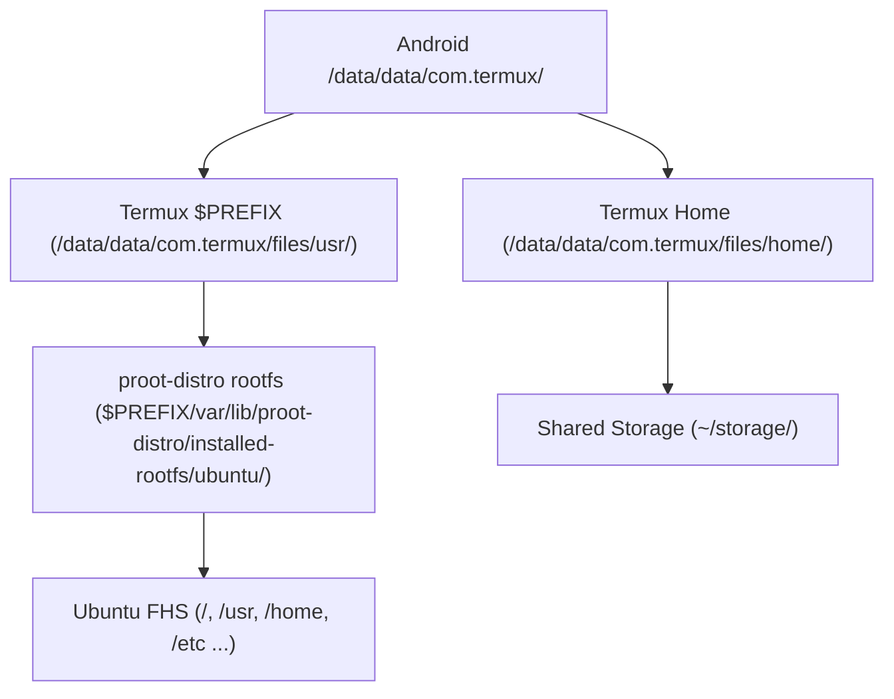

# Filesystem Layout

Reference map of every significant directory in an ADL installation, covering the Android, Termux, proot-distro, and Ubuntu layers.

## Overview

An ADL installation stacks four filesystem layers. Each layer has its own root, and paths that look identical may resolve to different physical locations depending on which context you are in.

<Note title="Path context matters">
`/usr/bin` inside the proot Ubuntu environment is **not** the same as `$PREFIX/bin` in Termux. Commands, libraries, and config files are distinct between contexts. Always confirm which shell you are in before modifying files.
</Note>

## Termux Filesystem

Termux operates entirely within the Android app sandbox. The base path is `/data/data/com.termux/files/`. The environment variable `$PREFIX` points to the `usr/` subtree.

| Path | Env Variable | Description |
|---|---|---|
| `/data/data/com.termux/files/home/` | `$HOME` | User home directory for the Termux shell |
| `/data/data/com.termux/files/usr/` | `$PREFIX` | Root of the Termux Unix-like filesystem |
| `$PREFIX/bin/` | -- | Executables installed by `pkg` |
| `$PREFIX/lib/` | -- | Shared libraries |
| `$PREFIX/etc/` | -- | Configuration files (Termux-level) |
| `$PREFIX/var/` | -- | Variable data, logs, proot-distro rootfs storage |
| `$PREFIX/share/` | -- | Architecture-independent data, man pages, fonts |
| `$PREFIX/tmp/` | `$TMPDIR` | Temporary files; cleared on app restart |

<Warning>
Do not manually move or rename `$PREFIX`. Termux hard-codes this path at build time. Altering it will break package management and most installed tools.
</Warning>

## proot-distro Filesystem

`proot-distro` stores each installed distribution as a full rootfs directory tree under `$PREFIX/var/lib/proot-distro/`.

| Path | Description |
|---|---|
| `$PREFIX/var/lib/proot-distro/` | proot-distro base directory |
| `$PREFIX/var/lib/proot-distro/installed-rootfs/` | Parent of all installed distro roots |
| `$PREFIX/var/lib/proot-distro/installed-rootfs/ubuntu/` | Ubuntu rootfs (default ADL distro) |
| `$PREFIX/var/lib/proot-distro/dlcache/` | Downloaded tarballs cache |

When you run `proot-distro login ubuntu`, proot remaps the Ubuntu rootfs directory to `/` inside the session. Every path below is relative to that remapped root.

## Ubuntu Filesystem Inside proot

Inside the proot Ubuntu session the filesystem follows standard Linux FHS conventions.

| Path | Description |
|---|---|
| `/` | Root of the Ubuntu filesystem (physically `$PREFIX/var/lib/proot-distro/installed-rootfs/ubuntu/`) |
| `/bin` | Essential user binaries (symlink to `/usr/bin` on modern Ubuntu) |
| `/etc` | System-wide configuration files |
| `/home` | Non-root user home directories |
| `/root` | Home directory for the root user |
| `/usr` | Secondary hierarchy: binaries, libraries, headers |
| `/usr/bin` | Most user commands |
| `/usr/lib` | Libraries for `/usr/bin` binaries |
| `/usr/share` | Architecture-independent data |
| `/var` | Variable data: logs, caches, spool |
| `/tmp` | Temporary files; writable by all users |
| `/opt` | Optional add-on software (manually installed tools) |

<Tip title="Installing packages inside proot">
Use `apt` (not `pkg`) when inside the Ubuntu proot session. The two package managers maintain separate databases and separate binary paths.
</Tip>

## Shared Storage

Running `termux-setup-storage` in the Termux shell creates symlinks under `~/storage/` that point to common Android directories. These links are accessible from both the Termux context and, if bind-mounted, from inside the proot session.

| Symlink | Android Path | Contents |
|---|---|---|
| `~/storage/shared/` | `/storage/emulated/0/` | Internal storage root |
| `~/storage/downloads/` | `/storage/emulated/0/Download/` | Browser and app downloads |
| `~/storage/dcim/` | `/storage/emulated/0/DCIM/` | Camera photos and videos |
| `~/storage/music/` | `/storage/emulated/0/Music/` | Music files |
| `~/storage/pictures/` | `/storage/emulated/0/Pictures/` | Screenshots, saved images |
| `~/storage/movies/` | `/storage/emulated/0/Movies/` | Video files |

<Note>
You must grant Termux storage permission in Android settings before running `termux-setup-storage`. The command will prompt for permission on first run.
</Note>

## Configuration File Locations

Key configuration files and where to find them in each context.

| Config Area | Path | Context |
|---|---|---|
| Bash (Termux) | `~/.bashrc`, `~/.profile` | Termux |
| Bash (Ubuntu) | `/root/.bashrc`, `/root/.profile` | Ubuntu proot |
| Termux properties | `~/.termux/termux.properties` | Termux |
| Termux font | `~/.termux/font.ttf` | Termux |
| Termux color scheme | `~/.termux/colors.properties` | Termux |
| XFCE4 desktop | `~/.config/xfce4/` | Ubuntu proot |
| XFCE4 panel | `~/.config/xfce4/panel/` | Ubuntu proot |
| XFCE4 terminal | `~/.config/xfce4/terminal/` | Ubuntu proot |
| proot-distro config | `$PREFIX/etc/proot-distro/` | Termux |
| VNC server | `~/.vnc/` | Ubuntu proot |
| VNC password | `~/.vnc/passwd` | Ubuntu proot |
| VNC startup script | `~/.vnc/xstartup` | Ubuntu proot |
| PulseAudio | `~/.config/pulse/`, `/etc/pulse/` | Ubuntu proot |
| User fonts | `~/.local/share/fonts/` | Ubuntu proot |
| System fonts | `/usr/share/fonts/` | Ubuntu proot |
| GTK themes | `~/.themes/`, `/usr/share/themes/` | Ubuntu proot |
| Icon themes | `~/.icons/`, `/usr/share/icons/` | Ubuntu proot |

## Important Paths Quick Reference

Single-table summary of the most referenced paths across all contexts.

| Path | Description | Context |
|---|---|---|
| `/data/data/com.termux/files/home/` | Termux user home | Termux |
| `/data/data/com.termux/files/usr/` | Termux prefix (`$PREFIX`) | Termux |
| `$PREFIX/bin/` | Termux-installed binaries | Termux |
| `$PREFIX/var/lib/proot-distro/installed-rootfs/ubuntu/` | Ubuntu rootfs on disk | Termux |
| `/` | Ubuntu root (inside proot) | Ubuntu |
| `/usr/bin/` | Ubuntu user binaries | Ubuntu |
| `/etc/` | Ubuntu system config | Ubuntu |
| `/root/` | Ubuntu root home | Ubuntu |
| `~/.config/xfce4/` | XFCE desktop config | Ubuntu |
| `~/.vnc/` | VNC server config | Ubuntu |
| `~/storage/shared/` | Android internal storage | Shared |
| `~/storage/downloads/` | Android downloads | Shared |

## Where to Store User Files

<BestPractice>
Keep personal projects and documents in a location accessible to both Termux and the proot Ubuntu session.
</BestPractice>

**Recommended locations:**

- **Inside the Ubuntu home directory** (`/root/` or `/home/<user>/` within proot) for projects that only need Ubuntu tools. These files physically reside under the rootfs path in Termux.
- **Shared storage** (`~/storage/shared/`) for files you also need from Android apps (file managers, media players, document editors). Be aware that Android may impose file-type restrictions on certain directories.
- **Termux home** (`$HOME` in Termux) for scripts and dotfiles that must run before entering proot.

<Warning title="Backup considerations">
The Ubuntu rootfs directory is large and changes frequently. If you uninstall proot-distro or reset the distribution with `proot-distro reset`, all files inside the rootfs are deleted. Store irreplaceable data on shared storage or back it up externally.
</Warning>
