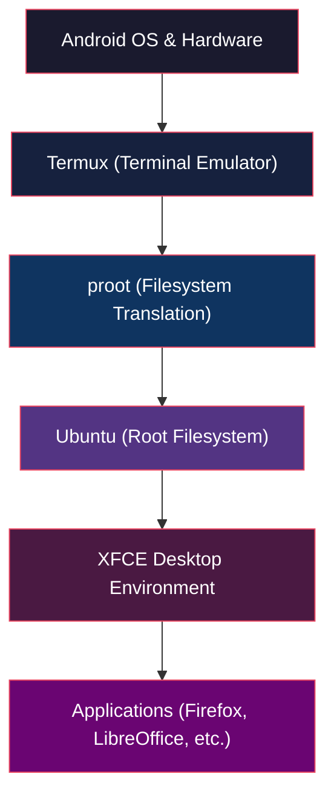

# Troubleshooting Overview

When something goes wrong with ADL, the key to fixing it quickly is understanding _where_ in the stack the problem originates. ADL is not a single piece of software --- it is a layered system where Android, Termux, proot, Ubuntu, and XFCE all interact. A failure at any layer can produce symptoms that appear at a different layer entirely.

This page explains how to approach diagnosing issues systematically. Start with the decision flow below to jump straight to the right page:

<TroubleshootingDecisionTree />

## The ADL Stack

Every component in ADL sits on top of the one below it. Problems cascade upward --- a Termux issue will break everything above it, while an XFCE problem leaves the layers below untouched.

## General Debugging Approach

### Step 1: Identify the Layer

Before trying fixes, determine which layer is causing the problem. Work from the bottom up:

1. **Android** --- Can you open Termux at all? Is Android killing background processes? Check battery optimization settings and Android-level permissions.
2. **Termux** --- Does Termux start and accept commands? Can you run basic commands like `ls` or `echo`? If Termux itself is broken, see the [Termux troubleshooting guide](/docs/troubleshooting/termux) or revisit the [Termux installation steps](/docs/quick-start/install-termux).
3. **proot** --- Does the `proot-distro login ubuntu` command succeed? Errors at this stage often involve missing or corrupted filesystem mappings.
4. **Ubuntu** --- Do package operations (`apt update`, `apt install`) work inside the proot environment? Missing dependencies or broken packages point to this layer.
5. **XFCE / Display** --- Does the desktop appear when you start the VNC server? Blank screens, resolution issues, and rendering problems live here. See the [display troubleshooting guide](/docs/troubleshooting/display).
6. **Applications** --- If the desktop works but a specific application crashes or misbehaves, the problem is at the application layer.

<BestPractice>
Always start debugging at the lowest layer and work upward. Fixing a problem at a higher layer is pointless if a lower layer is broken --- the fix will not hold.
</BestPractice>

### Step 2: Reproduce the Problem

Try to make the problem happen consistently. Note exactly what you did, what you expected, and what happened instead. If the problem is intermittent, pay attention to conditions --- does it happen only after a certain amount of time, only with certain apps, or only on certain Android versions?

### Step 3: Collect Information

Gather error messages and logs before attempting fixes. The specific commands depend on which layer you suspect.

## Collecting Logs and Error Messages

### Termux Session Output

The most immediate source of information is the terminal output itself. When something fails, scroll up in your Termux session to find error messages. Many problems print clear error text that points directly to the cause.

<Tip>
Long-press in Termux to access the "More" menu, then use "Select All" and "Copy" to capture the full terminal output for sharing in bug reports.
</Tip>

### System Logs Inside proot

Once inside the Ubuntu environment, you can check several log sources:

<CopyCommand command="cat /var/log/syslog 2>/dev/null || echo 'No syslog available'" />

<CopyCommand command="cat ~/.vnc/*.log" />

<CopyCommand command="dmesg 2>/dev/null || echo 'dmesg not available in proot'" />

<Note>
Not all log sources work inside proot. The `dmesg` command and some systemd journal features are unavailable because proot does not provide a real kernel interface. This is expected behavior, not an error.
</Note>

### Checking Process Status

To see what is currently running inside your ADL session:

<Terminal command="ps aux | grep -E 'Xvnc|xfce|pulse'" output="root      1234  0.5  2.1  Xvnc :1 -geometry 1920x1080
root      1235  0.2  1.0  xfce4-session
root      1236  0.1  0.8  pulseaudio --start" />

If expected processes are missing from this output, that tells you which component failed to start.

### Checking Disk Space

A full filesystem is a common cause of mysterious failures:

<CopyCommand command="df -h | head -5" />

Termux and the proot filesystem share your Android device's storage. If your device is low on space, package installations, file operations, and even starting the desktop can fail.

## Common Problem Categories

ADL issues generally fall into a few categories. Use this table to jump to the right troubleshooting guide:

| Symptom | Likely Layer | Guide |
|---|---|---|
| Termux closes or won't start | Android / Termux | [Termux Issues](/docs/troubleshooting/termux) |
| Black screen, no desktop appears | Display / VNC | [Display Issues](/docs/troubleshooting/display) |
| No sound or distorted audio | PulseAudio | [Audio Issues](/docs/troubleshooting/audio) |
| Cannot access the internet, downloads fail | Network / DNS | [Network Issues](/docs/troubleshooting/network) |
| Desktop is slow or apps lag | Performance | [Performance Issues](/docs/troubleshooting/performance) |
| Broken install, need to start over | Recovery | [Recovery](/docs/troubleshooting/recovery) |

## Quick Diagnostic Checks

<Troubleshooting items={[
  {
    problem: "ADL was working yesterday but now nothing starts",
    solution: "Android may have killed Termux in the background. Check that Termux is excluded from battery optimization. Restart Termux and try again. If the problem persists, check available disk space with `df -h` --- a full filesystem prevents many operations from succeeding."
  },
  {
    problem: "Commands work in Termux but fail inside proot",
    solution: "The proot environment may be corrupted. First, try exiting and re-entering with `exit` followed by `proot-distro login ubuntu`. If that does not help, run `proot-distro reset ubuntu` to reinstall the distribution (this erases data inside proot). See the recovery guide for backup procedures."
  },
  {
    problem: "Everything starts but the desktop looks wrong or is unusable",
    solution: "This is typically a display or performance issue rather than a fundamental ADL problem. Check the display troubleshooting guide for resolution and rendering fixes, and the performance guide if the desktop is simply too slow to use."
  }
]} />

## Getting Help

If you cannot resolve an issue using the troubleshooting guides, there are two places to seek help:

### GitHub Issues

For confirmed bugs --- things that used to work and stopped, or behavior that clearly contradicts the documentation --- open an issue on the ADL GitHub repository. Include:

- Your Android version and device model
- The exact error message or terminal output
- The steps you took before the problem occurred
- Whether the problem is reproducible

<Warning>
Do not open GitHub Issues for general usage questions. Use Discussions instead. Issues are for bug reports and feature requests.
</Warning>

### GitHub Discussions

For questions about how to do something, requests for advice, or problems where you are not sure if the behavior is a bug, use GitHub Discussions. The community and maintainers monitor Discussions and can often help quickly.

<CollapsibleSection title="Template for a good bug report">

**Device:** (e.g., Samsung Galaxy S24, Android 15)

**ADL version:** (output of `cat ~/adl-version` or the install date)

**Problem:** (one sentence describing what goes wrong)

**Steps to reproduce:**

1. Open Termux
2. Run `...`
3. Observe `...`

**Expected behavior:** (what should have happened)

**Actual behavior:** (what actually happened)

**Terminal output:** (paste the relevant error messages)

**What I already tried:** (list any fixes you attempted)

</CollapsibleSection>

## Next Steps

If you have identified which layer your problem belongs to, continue to the specific troubleshooting guide:

- [Termux Issues](/docs/troubleshooting/termux) --- Termux won't start, packages fail to install, Termux crashes
- [Display Issues](/docs/troubleshooting/display) --- black screen, wrong resolution, VNC connection problems
- [Audio Issues](/docs/troubleshooting/audio) --- no sound, crackling, PulseAudio failures
- [Network Issues](/docs/troubleshooting/network) --- no internet, DNS failures, slow downloads
- [Performance Issues](/docs/troubleshooting/performance) --- slow desktop, high CPU usage, out of memory
- [Recovery](/docs/troubleshooting/recovery) --- broken installs, data recovery, clean reinstallation
